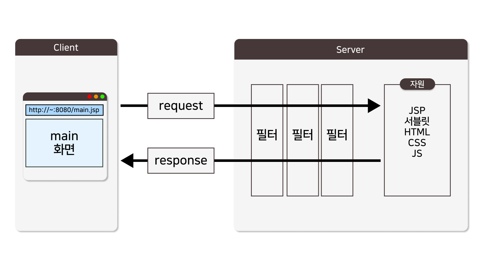

 **<h5>04월 03일 JSP Filter 수업1</h5>** <br>

 # Filter



- Filter : Java 웹 어플리케이션에서 HTTP 요청과 응답을 중간에서 가로채고 조작하는 데 사용되는 구성요소
- 여러 서블릿 클래스에서 반복되는 코드를 일괄적으로 처리하기 위해 사용한다.
- 필터는 주로 요청과 응답의 헤더 수정, 요청 데이터 검증, 인증 및 권한 부여, 로깅 등과 같은 작업을 수행하기 위해 사용된다.
- 자바 웹 어플리케이션 개발에서는 필터를 적용하기 위해 Filter 인터페이스를 구현.

<br>

### Filter Interface <br>
- 주요 메소드

|서드|설명|
|---|---|
|init()|필터 초기화 시 호출되며, 필터 설정 및 초기화 작업을 수행|
|doFilter()|실제 필터 동작을 정의하는 메서드, 요청과 응답을 가로채고 수정하는 작업을 수행, 필터 체인 내 다음 필터로 요청을 전달하거나 필터 체인의 끝에 도달하면 서블릿으로 요청 전달.|
|destroy()|필터가 소멸될 때 호출되며, 리소스 해제 또는 정리 작업 수행.|
<br>

### JSP 필터를 등록하는 방법 <br>
    : 필터는 주로 인코딩 및 문자 집합 처리, 인증 및 권한 검사, 로그 처리, 이미지 및 자원 압축 등에 사용.
    
    1. Filter 인터페이스를 구현한 클래스 정의
    2. web.xml에 등록
<br>

1. Filter 클래스 정의

- [NEW] -> [Ohter] -> [Filter] 클릭하여 클래스 파일 생성

``` java
import javax.servlet.*;
import java.io.IOException;

public class EncodingFilter implements Filter {
    private String encoding;

    public void init(FilterConfig filterConfig) throws ServletException {
        // web.xml에서 설정한 초기 매개변수 "encoding"을 읽어옵니다.
        encoding = filterConfig.getInitParameter("encoding");
    }

    public void doFilter(ServletRequest request, ServletResponse response, FilterChain chain)
            throws IOException, ServletException {
        // 요청과 응답의 문자 인코딩을 설정합니다.
        request.setCharacterEncoding(encoding);
        response.setCharacterEncoding(encoding);

        // 다음 필터로 요청을 전달합니다. 필터 체인의 끝에 도달하면 서블릿으로 요청이 전달됩니다.
        chain.doFilter(request, response);
    }

    public void destroy() {
        // 필터가 소멸될 때 필요한 정리 작업을 수행합니다.
    }
}
```
<br>

2. web.xml에 등록

```xml
<web-app>
    <!-- EncodingFilter를 필터로 등록합니다. -->
    <filter>
        <filter-name>EncodingFilter</filter-name>
        <filter-class>EncodingFilter</filter-class>
        <!-- 필터 초기 매개변수로 문자 인코딩을 설정합니다. -->
        <init-param>
            <param-name>encoding</param-name>
            <param-value>UTF-8</param-value>
        </init-param>
    </filter>

    <!-- 필터를 URL 패턴에 매핑합니다. -->
    <filter-mapping>
        <filter-name>EncodingFilter</filter-name>
        <url-pattern>/*</url-pattern>
    </filter-mapping>
    
    <!-- 다른 서블릿과 서블릿 매핑 설정 등을 추가할 수 있습니다. -->
</web-app>
```