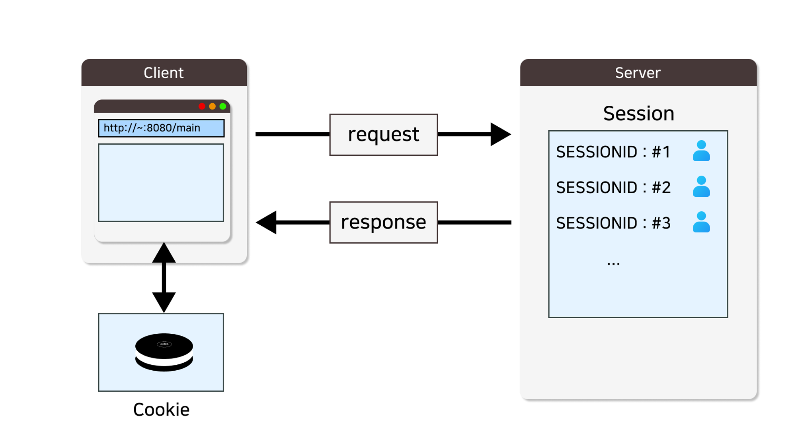

 **<h5>04월 03일 JSP Filter 수업2</h5>** <br>

 # session



- Session : 클라이언트와 웹 서버 간의 상태를 유지하는 방법
- 세션을 사용하는 주요 기능은 사용자 인증 및 로그인 관리, 장바구니 및 주문 처리 등이 있다.
<br>

### 세션 생명 주기 <br>
    : 세션은 클라이언트가 사이트에 접속한 순간부터 브라우저를 종료하는 시점까지 유지된다.
    - 로그인 정보는 세션에 등록되기 때문에 로그인 후 브라우저의 모든 탭을 종료하고 다시 사이트에 접속하면 로그아웃이 된다.
<br>

1. 생성, Creation
    : 클라이언트가 웹 애플리에키션에 최초로 접속하면, 서버는 해당 클라이언트를 위한 새로운 세션을 생성
    이때, 고유한 세션 식별자(ID)가 생성되고, 이 ID를 사용하여 세션을 식별
<br>

2. 활성화, Activation
    : 세션이 생성되면 활성 상태가 되며, 클라이언트와 서버 간의 데이터 교환 허용.
    클라이언트가 웹 애플리케이션에 요청을 보낼 때마다 세션은 활성화 상태를 유지
<br>

3. 비활성화, Inactivation
    : 세션은 일정 시간 동안 활성화 상태를 유지 후, 클라이언트의 요청이 없을 경우 비활성화 상태로 전환.
    이때, 메모리에서 해제되지 않고, 재활성화될 때까지 대기 
<br>

4. 종료, Expiration
    : 세션이 만료되면 종료, 만료는 두 가지 방법으로 발생
    첫 번째 방법은 세션을 만든 웹 애플리케이션 설정에 지정된 시간(세션 타임아웃)이 경과한 경우
    두 번째 방법은 세션을 프로그래밍적으로 무호화(Invalidate)하는 경우
<br>

5. 강제 종료, Forced Termination
    : 웹 애플리케이션 개발자나 관리자가 필요한 경우 세션을 직접 무효화 하는 경우,
    세션은 즉시 종료되고, 클라이언트는 다시 세션을 생성해야 한다.
<br>

### 세션 내장 객체의 주요 메소드 <br>
- 주요 메소드

|메소드|설명|
|---|---|
|getAttribute(String name)|세션에서 특정 속성의 값을 가져옴.|
|setAttribute(String name, Object value)|세션에서 새로운 속성을 설정하거나 기존 속성의 값을 업데이트.|
|removeAttribute(String name)|세션에서 특정 속성을 제거.|
|getId()|현재 세션의 고유한 식별자(ID)를 반환.|
|setMaxInactiveInterval(int interval)|세션의 비활성화 시간 제한을 설정.|
|getMaxInactiveInterval()|세션의 빌활성 시간 제한을 반환.|
|invalidate()|현재 세션을 무효화 시키고, 세션의 모든 속성과 데이터를 삭제.|
|isNew()|현재 세션이 새로 생성되었는지 여부 확인.|
|getCreationTime()|세션이 생성된 시간을 반환.|
|getLastAccessedTime()|세션에서 마지막으로 액세스한 시간을 반환.|
<br>

### 세션 생성 <br>
```java
session.setAttribute("userId", userId);
```
<br>

### 세션 정보 <br>
```java
// 단일 세션 정보
session.getAttribute("userId");

// 다중 세션 정보
Enumeration en = session.getAttributeNames();
    int i = 0;

    while (en.hasMoreElements()) {
        i++;
        name = en.nextElement().toString();				// 세션 속성이름 가져오기
        value = session.getAttribute(name).toString();	// 세션 속성값 가져오기
        out.println("설정된 세션의 속성 이름 [ " + i + " ] : " + name + "<br>");
        out.println("설정된 세션의 속성 값 [ " + i + " ] : " + value + "<br>");
        out.println("----------------------------------------------<br>");
    }
```
<br>

### 세션 삭제 <br>
```java
// 단일 세션 삭제
session.removeAttribute("userId");

// 다중 세션 삭제
session.invalidate();
```
<br>

### 세션 유효 여부 확인 <br>
```java
// isRequestedSessionIdValid
// : 해당 요청이 속한 session 이 유효한지 여부를 반환하는 메소드
if (request.isRequestedSessionIdValid() ) {
	out.print("세션이 유효합니다.");
} else {
	out.print("세션이 유효하지 않습니다.");
}
```
<br>

### 세션 유효시간 <br>
```java
// 세션 유효시간 확인
// getMaxInactiveInterval()
// : 세션의 유효시간을 반환하는 메소드
int time = session.getMaxInactiveInterval() / 60;

out.println("세션 유효 시간  : " + time + "분<br>");

// 세션 유효시간 설정
// setMaxInactiveInterval()
// : 초 단위로 세션의 유효시간을 설정하는 메소드
session.setMaxInactiveInterval(60 * 60);     // 유효시간 60 분으로 설정
```
<br>

