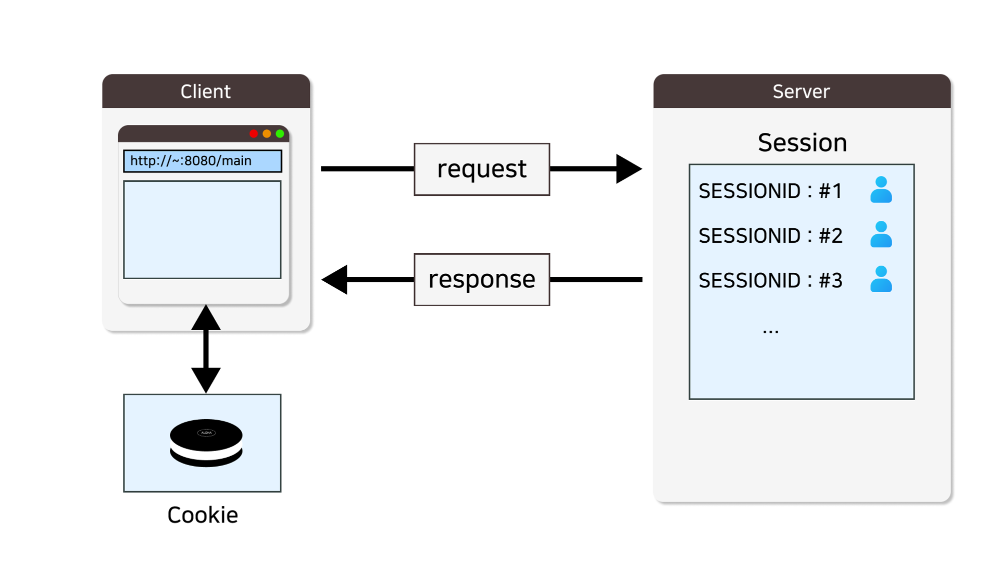
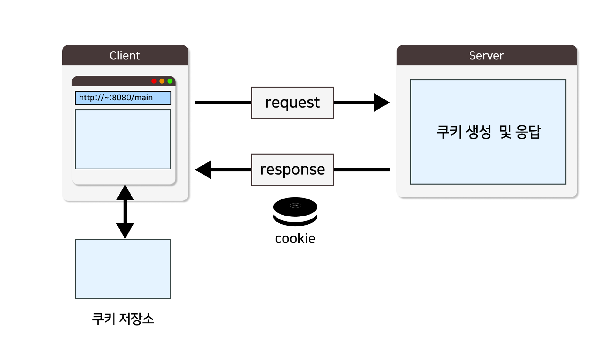
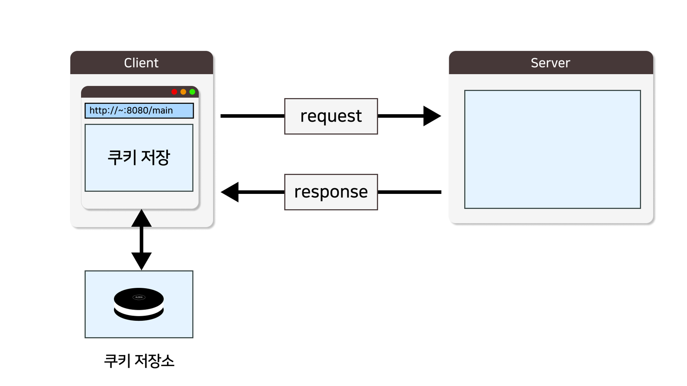
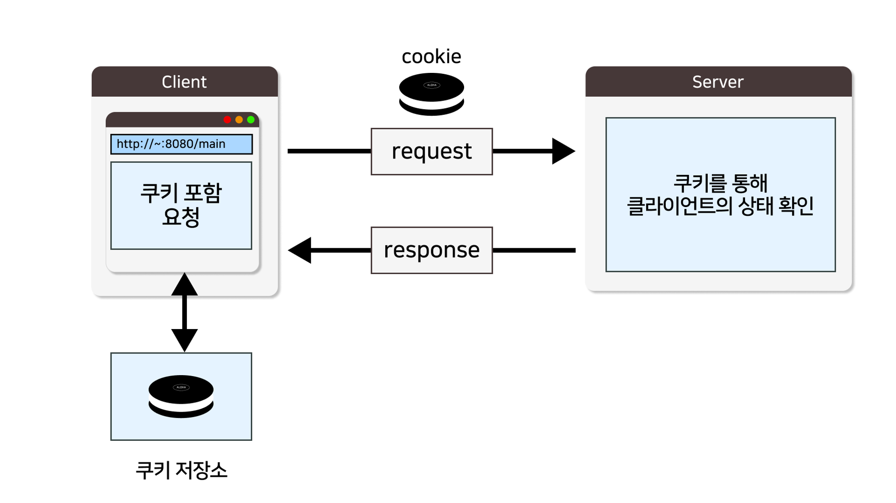

 **<h5>04월 03일 JSP Cookie 수업3</h5>** <br>

 # Cookie



- Cookie : 웹 서버와 클라이언트 간의 상태 정보를 저장하고 주고받을 수 있는 작은 데이터 조각
- 쿠키를 사용하는 주요 기능은 사용자 인증 및 로그인 관리, 장바구니 및 주문 처리, 아이디 저장, 언어 및 지역설정
다크 모드 등이 있다.
<br>

### 쿠키 생성 및 저장 <br>

1. 쿠키 생성 단계 
    - 쿠키는 처음 서버 측에서 생성되어 응답에 담겨서 전송됨.


<br>
<hr>

2. 쿠키 저장 단계 
    - 클라이언트는 응답 받은 쿠리를 쿠키 저장소에 저장.



<br>
<hr>

3. 쿠키 전송 단계
    - 클라이언트가 같은 경로 (URL)로 요청 시, 쿠키를 포함하여 요청 전송.



<br>
<hr>

### Cookie 메소드 <br>

|메소드|설명|
|---|---|
|Cookie(String name, String vlaue)|지정된 이름과 값으로 새로운 쿠키 객체 생성|
|getName()|쿠키 이름 반환|
|getValue()|쿠키 값 반환|
|setValue(String value)|쿠키 값 설정|
|getPath()|쿠키 경로 반환|
|setPath(String path)|쿠키 경로 설정|
|getDomain()|쿠키 도메인 반환|
|setDomain(String domain)|쿠키 도메인 설정|
|getMaxAge()|쿠키 유효 기간 초 단위로 반환|
|setMaxAge(int maxAge)|쿠키 유효 기간 초 단위로 설정|
|getSecure()|쿠키의 보안 속성 반환, True:보안 쿠키, false: 일반 쿠키|
|setSecure(boolean secure)|쿠키의 보안 속성을 설정|
|isHttpOnly()|쿠키가 HTTP 전용인지 여부를 반환|
|setHttpOnly(boolean httpOnly)|쿠키를 HTTP 전용으로 설정|
<br>

### 쿠키 사용 <br>
```java 
// 쿠키 생성
Cookie cookie = new Cookie("쿠키 이름", 쿠키 값);
response.addCookie(cookie);

// 쿠키 정보
Cookie[] cookies = request.getCookies();
String myCookie = "";

for(int i = 0 ; i < cookies.length ; i++) {
	if( cookies[i].getName().equals("쿠키이름") ) {
		myCookie = cookies[i].getValue(); 
	}
}

// 쿠키 삭제
Cookie cookie = new Cookie("삭제할 쿠키명", "");
cookie.setMaxAge(0);     // 유효시간 0으로 설정
response.addCookie(cookie);
/* 쿠키는 클라이언트 측에 저장되기 때문에, 직접적으로 delete, remove 하는게 아니라
 * 서버 측에서 다시 생성해서 유효 시간을 소멸시킨 쿠키로 덮어쓰기 하는 개념으로 삭제한다.
*/

```