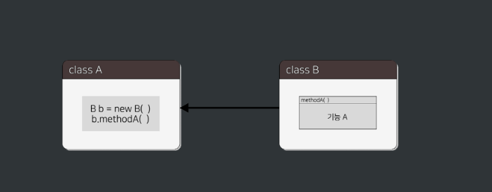

 **<h5>04월 15일 Spring 1일차 수업1</h5>** <br>

# Spring
<br>

### Spring Framwork란? <br>
    - 스프링 프레임워크는 Java 기반의 오픈 소스 애플리케이션 프레임워크
    - 자바 객체를 사용하여 엔터프라이즈급 애필리케이션을 구축하는데 사용
    - 다양한 모듈과 기능을 제공하여 개발자들이 애플리케이션을 더 쉽게 구축하고 유지할 수 있도록 지원
    - 스프링 프레임 워크의 핵심 기능은 제어 역전(IoC) 컨테이너와 의존성 주입(DI) 입니다
    - 이런 기능을 통해 객체 간의 결합도를 낮추고, 유연하고 테스트 가능한 코드를 작성할 수 있습니다.
    - 관계형 데이터베이스 액세스, 웹 애플리케이션 개발, 보안, 트랜잭션 관리 등을 위한 다양한 모듈이 제공됨.

<br>

### 의존성 주입 (Dependency Injection) <br>
    - 의존성 주입은 스프링워크의 핵심 기능 중 하나로, 객체 간의 의존 관계를 스프링이 자동으로 관리하도록 하는 기능입니다.
    - 의존성 주입은 객체가 필요로 하는 의존 객체를 스프링이 자동으로 주입해주는 방식으로 동작합니다.
    - 의존성 주입을 사용하면 객체 간의 결합도를 낮춰, 코드의 재사용성과 유지보수성을 향상시킬 수 있습니다.
    - 스프링 프레임워크에서는 생성자 주입, 필드 주입, 메서드 주입 등 다양한 방법으로 의존성 주입을 지원합니다.

<br>

### Java에서 의존성이란?
    : 하나의 클래스가 다른 클래스를 사용하여 의존하고 있는 상태를 의미합니다.
    - ex) A 클래스에서 B 클래스를 사용하는 것을 "A 클래스가 B 클래스의 의존한다" 라고 표현할 수 있습니다.

<br>

```java
// A클래스가 B클래스의 의존하고 있는 예시 코드

// 클래스 B 정의
public class B {
    public void method() { 
        System.out.println("클래스 B의 메서드 수행");
    }
}

// 클래스 A 정의
public class A {
    private B b; // 클래스 B에 대한 의존성을 가집니다.

    // 생성자를 통해 클래스 B의 객체를 주입 받습니다.
    public A(B b) {
        this.b = b;
    }

    public void execute() {
        System.out.println("클래스 A의 기능 수행");
        // 클래스 A는 클래스 B의 메서드를 호출하여 사용합니다.
        b.method();
    }

    public static void main(String[] args) {
        // 클래스 B의 객체를 생성합니다.
        B b = new B(); 

        // 클래스 A의 객체를 생성하면서 클래스 B의 객체를 주입합니다.
        A a = new A(b); 

        // 클래스 A의 기능을 실행합니다.
        a.execute();
    }
}
```

<br>

### 의존의 종류 <br>
    - 클래스 의존 : 하나의 클래스가 다른 클래스를 사용하는 것
    - 인터페이스 의존 : 하나의 클래스가 특정 인터페이스를 구현한 다른 클래스를 사용하는 것


<br>

### 클래스 의존 VS 인터페이스 의존 <br>

|의존|클래스 의존|인터페이스 의존|
|--|--|--|
|결합도|높음|낮음|
|응집도|낮음|높음|

<br>

**결론 : 인터페이스 의존이 결합도가 낮고, 응집도가 높아 클래스 의존보다 유지보수하기 쉽다.**

<br>




