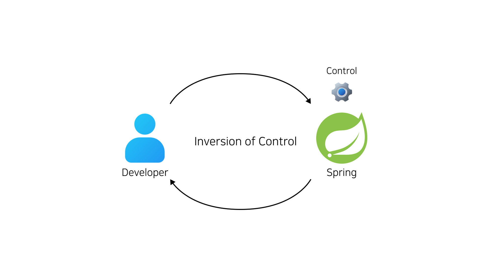
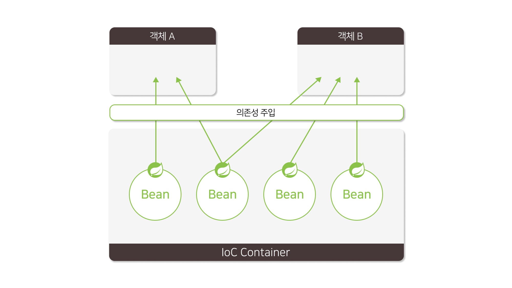
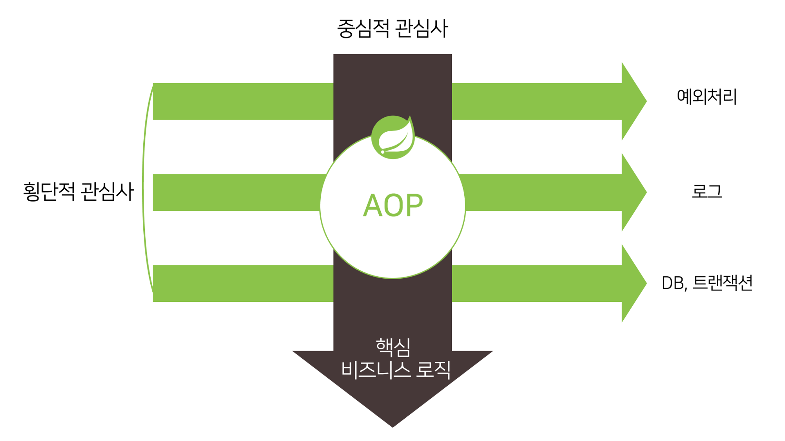

 **<h5>04월 15일 Spring 1일차 수업1</h5>** <br>

# Spring
<br>

### Spring Framwork란? <br>
    - 스프링 프레임워크는 Java 기반의 오픈 소스 애플리케이션 프레임워크
    - 자바 객체를 사용하여 엔터프라이즈급 애필리케이션을 구축하는데 사용
    - 다양한 모듈과 기능을 제공하여 개발자들이 애플리케이션을 더 쉽게 구축하고 유지할 수 있도록 지원
    - 스프링 프레임 워크의 핵심 기능은 제어 역전(IoC) 컨테이너와 의존성 주입(DI) 입니다
    - 이런 기능을 통해 객체 간의 결합도를 낮추고, 유연하고 테스트 가능한 코드를 작성할 수 있습니다.
    - 관계형 데이터베이스 액세스, 웹 애플리케이션 개발, 보안, 트랜잭션 관리 등을 위한 다양한 모듈이 제공됨.

<br>

### 의존성 주입 (Dependency Injection) <br>
    - 의존성 주입은 스프링워크의 핵심 기능 중 하나로, 객체 간의 의존 관계를 스프링이 자동으로 관리하도록 하는 기능입니다.
    - 의존성 주입은 객체가 필요로 하는 의존 객체를 스프링이 자동으로 주입해주는 방식으로 동작합니다.
    - 의존성 주입을 사용하면 객체 간의 결합도를 낮춰, 코드의 재사용성과 유지보수성을 향상시킬 수 있습니다.
    - 스프링 프레임워크에서는 생성자 주입, 필드 주입, 메서드 주입 등 다양한 방법으로 의존성 주입을 지원합니다.

<br>

### Java에서 의존성이란?
    : 하나의 클래스가 다른 클래스를 사용하여 의존하고 있는 상태를 의미합니다.
    - ex) A 클래스에서 B 클래스를 사용하는 것을 "A 클래스가 B 클래스의 의존한다" 라고 표현할 수 있습니다.

<br>

```java
// A클래스가 B클래스의 의존하고 있는 예시 코드

// 클래스 B 정의
public class B {
    public void method() { 
        System.out.println("클래스 B의 메서드 수행");
    }
}

// 클래스 A 정의
public class A {
    private B b; // 클래스 B에 대한 의존성을 가집니다.

    // 생성자를 통해 클래스 B의 객체를 주입 받습니다.
    public A(B b) {
        this.b = b;
    }

    public void execute() {
        System.out.println("클래스 A의 기능 수행");
        // 클래스 A는 클래스 B의 메서드를 호출하여 사용합니다.
        b.method();
    }

    public static void main(String[] args) {
        // 클래스 B의 객체를 생성합니다.
        B b = new B(); 

        // 클래스 A의 객체를 생성하면서 클래스 B의 객체를 주입합니다.
        A a = new A(b); 

        // 클래스 A의 기능을 실행합니다.
        a.execute();
    }
}
```

<br>

### 의존의 종류 <br>
    - 클래스 의존 : 하나의 클래스가 다른 클래스를 사용하는 것
    - 인터페이스 의존 : 하나의 클래스가 특정 인터페이스를 구현한 다른 클래스를 사용하는 것


<br>

### 클래스 의존 VS 인터페이스 의존 <br>

|의존|클래스 의존|인터페이스 의존|
|--|--|--|
|결합도|높음|낮음|
|응집도|낮음|높음|

<br>

**결론 : 인터페이스 의존이 결합도가 낮고, 응집도가 높아 클래스 의존보다 유지보수하기 쉽다.**

<br>


- A 클래스는 B 클래스의 의존합니다.
• A 클래스에서, B 객체(인스턴스) 생성
• A 클래스에서, B 객체의 메소드(methodA) 호출

```java
// B 클래스 정의
public class B {
    public void methodA() {
        System.out.println("B 클래스의 methodA() 메서드 호출");
    }
}

// A 클래스 정의
public class A {
	  public void execute() {
        B b = new B();
        b.methodA();
    }
}
```

### 의존성 주입 <br>
    : 해당 클래스가 사용할 객체를 외부에서 생성하여 대입하는 것

- 의존성 주입 종류
    1. 생성자 주입 (Constructor Injection)
    2. 세터 주입 (Setter Injection)
<br>

#### 생성자 주입 <br>
1. 특징:
    • 생성자 주입은 객체를 생성할 때 해당 객체의 의존성을 주입하는 방법입니다.
    • 주로 필수적인 의존성을 주입할 때 사용됩니다.
    • 객체를 생성하는 시점에 의존성이 명확하게 결정되고 변경되지 않아야 할 때 적합합니다.
    <br>
2. 사용 방법:
    • 클래스의 생성자에 의존성을 전달받는 매개변수를 추가합니다.
    • 주입하려는 의존성을 생성자 매개변수로 전달하고, 이를 필드에 저장합니다.
<br>

#### 세터 주입 <br>
1. 특징:
    • 세터 주입은 객체 생성 후에 의존성을 주입하는 방법입니다.
    • 주로 선택적인 의존성을 주입할 때 사용됩니다.
    • 의존성이 변경 가능하거나 여러 번 변경되어야 할 때 적합합니다.
    <br>
2. 사용 방법:
    • 클래스 내에 Setter 메서드를 만들고 해당 메서드를 통해 의존성을 주입합니다.
    • 주입하려는 의존성을 Setter 메서드의 매개변수로 전달하고, 이를 필드에 저장합니다.
<br>

### 의존성 주입의 필요성 <br>

- 의존성 주입(Dependency Injection)은 프로그램에서 클래스 간의 결합도를 낮추고 유지보수를 용이하게 하기 위한 기법
- 클래스가 직접 의존 객체를 생성하지 않고, 외부에서 필요한 객체를 주입받음으로써, 의존성 관리를 간소화하여 개발자가 비즈니스 로직과 알고리즘 개발에 더 집중할 수 있도록 돕습니다. 
- 이 방식은 인터페이스에 의존하여 의존성을 관리하며, 실제 객체 생성과 주입은 외부에서 처리됩니다.

<br>

### 의존성 주입의 장점 <br>
    • 객체간 결합도 감소 (느슨한 결합)
        ◦ 코드 변경과 유지보수가 쉬워진다.

    • 코드의 재사용성 향상
        ◦ 기존의 코드를 변경하지 않고도 새로운 코드를 추가하기 쉬워진다.

    • 테스트 용이성 향상
        ◦ 테스트용 의존성을 주입하여, 테스트를 쉽게 수행할 수 있다.

<br>

### Framework <br>
    프레임워크는 프로그램 개발의 생산성과 유지보수를 향상시키기 위해 고안된 도구. 

    이는 반복적이고 공통적인 작업, 예를 들어 의존성 관리와 같은 작업을 사전에 구성해 둠으로써 

    개발자가 핵심 기능 개발에 집중할 수 있게 도와줍니다. 
    
    예를 들어, Java 개발에서 널리 사용되는 Spring Framework는 의존성 주입과 AOP(관점 지향 프로그래밍)를 제공합니다. 이렇게 
    
    프레임워크가 일부 제어 작업을 맡는 것을 '제어의 역전'이라고 부르며, 
    
    이는 개발자가 프로그램의 전반적인 제어권을 프레임워크에게 넘기는 것을 의미합니다. 
    
    이를 통해 개발 프로세스가 더 효율적이고 구조화됩니다.
<br>


### IoC; Inversion of Control <br>
- 제어의 역전 (IoC; Inversion of Control)



    - 제어의 역전(IoC; Inversion of Control)은 개발자가 객체의 생명 주기 및 의존성 관리를 하던 것을 스프링이 대신 처리하도록 하는 것을 의미합니다. 

<hr>

### IoC 컨테이너 <br>



    - IoC(제어의 역전) 컨테이너는 스프링 프레임워크의 중심 기능으로, 
    객체의 생명주기와 의존성 관리를 스프링이 처리하게 함으로써 개발자가 객체 생성과 구성을 
    직접 하는 대신 필요한 객체를 요청하고 주입받습니다. 이를 통해 객체 간의 결합도를 낮추고, 
    유연하며 관리하기 쉬운 코드를 작성할 수 있게 도와줍니다. 

    IoC 컨테이너를 사용함으로써, 개발자는 애플리케이션의 구성 요소를 효율적으로 관리하고, 
    스프링이 제공하는 다양한 기능과 모듈을 효과적으로 활용할 수 있습니다. 

    이는 애플리케이션의 동작을 유연하게 제어하고, 개발 과정을 보다 효과적으로 지원합니다.
<br>

### Bean <br>
- 의존성 주입을 위해 IoC 컨테이너가 관리하는 객체를 의미
<br>

### 관점 지향 프로그래밍 (AOP) <br>



    : 프로그램의 횡단적 관심사를 중심적 관심사(비즈니스 로직)로부터 분리시켜 모듈화하는 프로그래밍 패러다임

<br>

- 중심적 관심사 (Core Concern) <br>
    : 소프트웨어의 핵심 기능과 로직에 직접적으로 관련된 부분, 비즈니스 로직
<br>

- 횡단적 관심사 (Cross-Cutting Concern) <br>
    : 중심적 관심사를 지원하고 보완하는 부수적인 부분, 반복적으로 사용되는 공통 로직

    • 예외처리
    • 로깅
    • 보안
    • 트랜잭션
<br>

- AOP의 필요성 <br>
    - 중심적 관심사는 소프트웨어의 주요 비즈니스 로직을 말하며, 
    - 횡단적 관심사는 로깅, 보안, 예외처리, 트랜잭션과 같은 반복적이고 보조적인 기능을 포함합니다. 
    
    - AOP(관점 지향 프로그래밍)는 이러한 횡단적 관심사를 중심 로직에서 분리하여 관리함으로써 코드 중복을 줄이고 유지보수를 용이하게 하는 데 필요합니다. 
    - AOP를 사용하면 개발자는 핵심 로직에 집중할 수 있고, 부수적인 코드는 자동으로 적절한 시점에 실행되도록 할 수 있습니다

<br>

### AOP 주요 용어 <br>
|용어|설명|
|---|---|
|어드바이스(Advice)|관점에서 수행할 작업을 정의한 코드 블록입니다.|
|관점 (Aspect)|관심사의 모듈화된 단위로, 어드바이스와 포인트컷으로 구성됩니다.|
|조인포인트 (Join Point)|어드바이스가 적용될 수 있는 코드의 특정 지점(메서드 호출, 예외 발생 등)입니다.|
|포인트컷 (Pointcut)|어드바이스가 적용될 Join Point를 선택하는 표현식입니다.|
|타겟 (Target)|관심사가 적용되는 대상 객체 또는 메서드입니다.|

