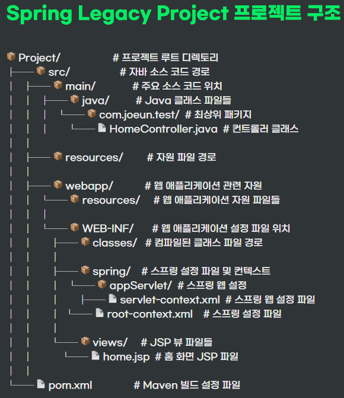

 **<h5>04월 16일 Spring 2일차 수업1</h5>** <br>

# Spring 프로젝트 구조 <br>

### Spring Legacy Project 구조



### 수업에서 사용할 버전으로 세팅

- 버전 변경 <br> 
    • 기본 <br>
        ◦ Java 버전 : 1.6 <br>
        ◦ Spring 버전 : 3.1.1.RELEASE <br>
        ◦ Servlet 버전 : 2.5 <br>
        ◦ JSP 버전 : 2.1 <br>
        ◦ Maven 플러그인 자바 버전 : 1.6 <br>
    <br>
    • 변경 버전 <br>
        ◦ Java 버전 : 1.8,  11 <br>
        ◦ Spring 버전 : 5.0.7.RELEASE <br>
        ◦ Servlet 버전 : 3.1 <br>
        ◦ JSP 버전 : 2.1 <br>
        ◦ Maven 플러그인 자바 버전 : 1.8, 11 <br>
<br>

- pom.xml
```xml
<!-- 자바 버전 : 1.6 → 1.8 -->
<java-version>1.8</java-version>
<!-- 스프링 버전 : 3.1.1 → 5.0.7 -->
<org.springframework-version>5.0.7.RELEASE</org.springframework-version>

<!-- Servlet -->
		<!-- 서블릿 버전 : 2.5 → 3.1 -->
<!-- 		<dependency> -->
<!-- 			<groupId>javax.servlet</groupId> -->
<!-- 			<artifactId>servlet-api</artifactId> -->
<!-- 			<version>2.5</version> -->
<!-- 			<scope>provided</scope> -->
<!-- 		</dependency> -->
		<dependency>
		    <groupId>javax.servlet</groupId>
		    <artifactId>javax.servlet-api</artifactId>
		    <version>3.1.0</version>
		    <scope>provided</scope>
		</dependency>

<!-- 자바 버전 : 1.6 → 1.8 -->
  <plugin>
      <groupId>org.apache.maven.plugins</groupId>
      <artifactId>maven-compiler-plugin</artifactId>
      <version>2.5.1</version>
      <configuration>
          <source>1.8</source>
          <target>1.8</target>
          <compilerArgument>-Xlint:all</compilerArgument>
          <showWarnings>true</showWarnings>
          <showDeprecation>true</showDeprecation>
      </configuration>
  </plugin>
```

- web.xml
```xml
<web-app version="3.1" xmlns="http://java.sun.com/xml/ns/javaee"
	xmlns:xsi="http://www.w3.org/2001/XMLSchema-instance"
	xsi:schemaLocation="http://java.sun.com/xml/ns/javaee https://java.sun.com/xml/ns/javaee/web-app_3_1.xsd">
...
```