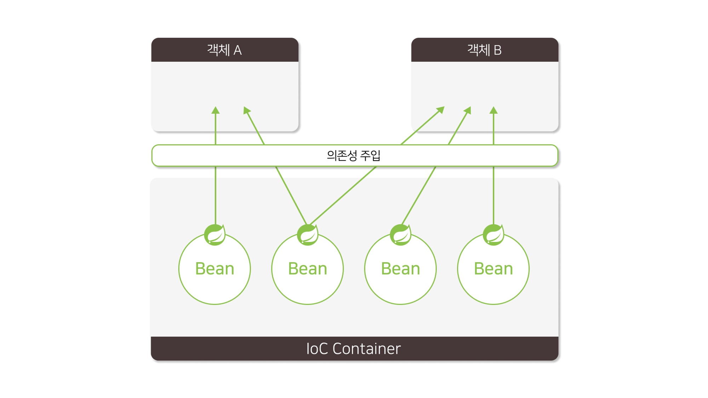

 **<h5>04월 17일 Spring 3일차 수업1</h5>** <br>

# Spring DI
    : 스프링 프레임워크를 사용하여 의존성 주입을 하는 방법



<br>

### 빈 등록 방법 <br>

    1. XML 설정
        a. root-context.xml 
        b. <bean id=”” class=”” /> 빈 태그로 등록

    2. 어노테이션으로 등록
        a. @Component, @Service, @Repository, @Controller 

    3. 자바 빈 설정 파일로 등록
        a. @Configuration 설정 클래스 정의
        b. @Bean 객체를 반환하는 메소드를 정의

- 빈 등록 - XML 설정 
```xml
<!-- BoardDAO 빈을 정의 -->
<bean id="boardDAO" class="com.aloha.spring.dao.BoardDAO">
</bean>
```
<br> 

- 빈 등록  - @어노테이션

|어노테이션|역할|
|----|----|
|@Component|일반적인 스프링 빈으로 사용됨.|
|@Controller|Spring MVC 컨트롤러로 사용되는 클래스를 나타냄.|
|@Service|비즈니스 로직을 처리하는 서비스 클래스를 나타냄.|
|@Repository|데이터 액세스 객체 (DAO)를 나타냄.|

- servlcet-context.xml

```xml
<context:component-scan base-package="com.aloha.spring" />
```

```java
// 클래스
@Component
public class MyComponent {

}
// 스프링 빈으로 등록할 클래스는 `@Component` 어노테이션을 붙여주면 컴포넌트 스캔 시, 인식되어 Ioc 컨테이너에 등록된다.

// BoardService.java
@Service
public class BoardService {

}
// `@Service` 어노테이션을 사용하면 비즈니스 로직을 처리하는 스프링 빈 클래스로 지정하여 Ioc 컨테이터에 빈으로 등록된다.

// BoardDAO.java
@Repository
public class BoardDAO {

}
// `@Repository` 어노테이션을 사용하면 데이터 액세스 계층의 클래스에 지정하여 Ioc 컨테이터에 빈으로 등록된다.

// BoardControler.java
@Controller
public class BoardController {

}
// `@Controller` 어노테이션을 사용하면 웹 애플리케이션의 컨트롤러 클래스로 지정하여 Ioc 컨테이터에 빈으로 등록된다.

```