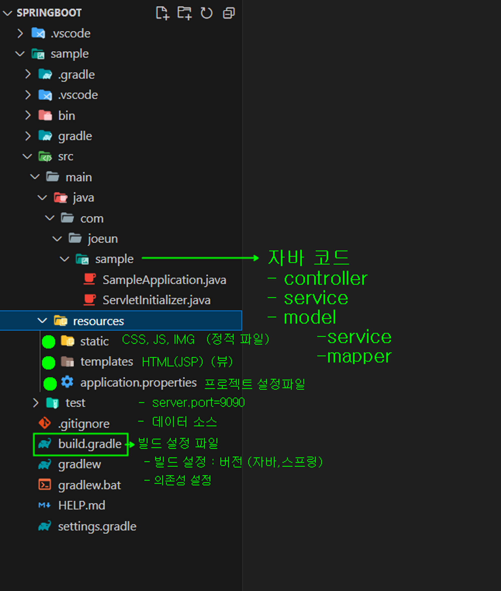
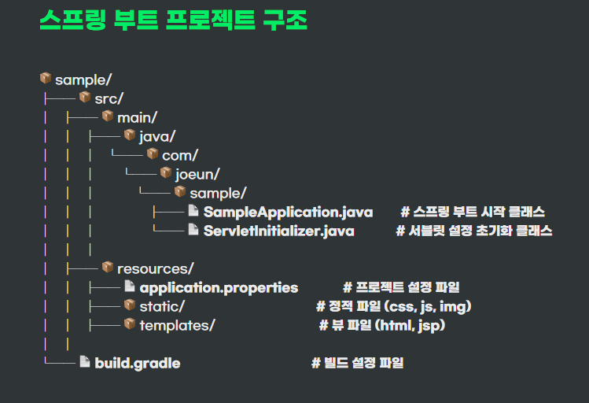

 **<h5>04월 22일 Spring 6일차 수업2</h5>**  

# Spring 프로젝트 구조
 

### Spring Boot 프로젝트 구조  

 

 

- SampleApplication.java  

    : Spring Boot 애플리케이션의 메인 애플리케이션 클래스입니다. 여기에는 main 메서드가 있으며, 애플리케이션을 실행하는 진입점 역할을 합니다. 
    이 클래스는 Spring 애플리케이션을 초기화하고 구성합니다. 
 

- ServletInitializer.java  

    : Spring Boot 애플리케이션을 서블릿 기반 웹 애플리케이션으로 설정하기 위한 클래스입니다. 이 클래스는 SpringBootServletInitializer를 확장하고 configure 메서드를 오버라이드하여 서블릿 컨테이너에서 애플리케이션을 설정합니다. 
    이 클래스는 WAR(웹 애플리케이션 아카이브)로 배포할 때 사용됩니다.
 

- application.properties  

    : Spring Boot 애플리케이션의 구성 속성을 정의하는 속성 파일입니다. 데이터베이스 연결 정보, 서버 포트 및 다른 구성 설정을 포함할 수 있습니다.
 

- build.gradle  

    : 프로젝트의 의존성 및 빌드 구성을 정의하는 Gradle 빌드 스크립트입니다. 일반적으로 Spring Boot 프로젝트의 의존성을 관리하고 빌드 설정을 구성하는 데 사용됩니다.
 

 