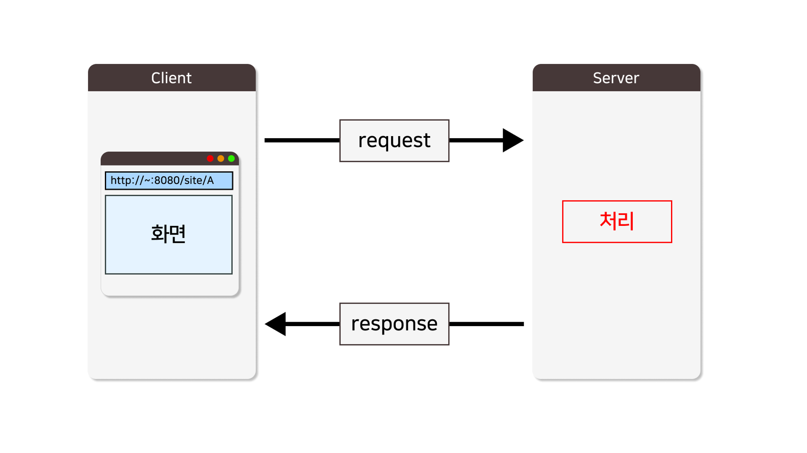

**<h5>04월 23일 Spring 7일차 수업1</h5>** <br>

# Spring Boot Response <br>

 <br>

### Response <br>
    : 서버에서 클라이언트로 보내는 응답 메시지로, 

    클라이언트의 요청에 대한 상태 및 해당 요청과 함께 전달되는 데이터를 정의합니다.

<br>

### 스프링 부트로 서버에서 응답하기 <br>

    @RestController : JSON 또는 XML과 같은 데이터를 반환하는 컨트롤러를 지정하는 어노테이션

    @RestController = @Controller + @ResponseBody
<br>

```java
/**
 * 🟢🟡🔴 @RestController
 * : JSON 또는 XML과 같은 데이터를 반환하는 컨트롤러를 지정하는 어노테이션
 * 🔵 RESTful 웹 서비스를 생성하는 데 사용
 * 🔵 @Controller 와 @ResponseBody를 합한 역할을 하는 어노테이션
 * ✔ @Controller       ➡ View를 반환
 * ✔ @RestController   ➡ 응답 데이터(메시지[상태코드,응답헤더,응답본문(body)])를 반환
 */
@Slf4j
@RestController
public class ResponseController {

}
```
<br>

### 여러가지 응답 타입 <br>
```java
/**
 * 🚀 void
 * - void를 반환하는 경우, 스프링부트는 해당 엔드포인트에 대해 아무것도 반환하지 않습니다. 
 * - 일반적으로 이는 리다이렉션, 페이지 이동 등의 기능에 사용됩니다.
 * - 어떤 작업을 수행하고 응답이 필요 없는 경우
 * ✅ 상태코드 : 200 OK
 * ✅ body : ❌
 */
@GetMapping("/void")
public void voidResponse() {
    log.info("[GET] - /void");
}

/**
 * 🚀 String 
 * - 반환하는 문자열로, HTTP 응답의 본문(body)에 지정한다.
 * - String을 반환하는 경우, 해당 String 값은 HTTP 응답 본문으로 반환됩니다. 
 * - 스트링은 일반적으로 HTML, JSON, XML 등과 같은 텍스트 기반의 데이터를 응답에 사용
 * ✅ 상태코드 : 200 OK
 * ✅ body : "문자열 데이터를 응답합니다."
 */
@GetMapping("/string")
public String stringResponse() {
    log.info("[GET] - /string");
    return "문자열 데이터를 응답합니다.";
}

/**
 * 🚀 객체 
 * - 객체를 JSON 또는 XML과 같은 형식으로 직렬화하여 변환하고, 이를 HTTP 응답 본문에 지정한다.
 * ✅ 상태코드 : 200 OK
 * ✅ body : {"boardNo":0,"title":"제목1","writer":"작성자1","content":"내용1","regDate":null,"updDate":null,"views":0}
 * @return
 */
@GetMapping("/object")
public Board objectResponse() {
    log.info("[GET] - /object");
    Board board = new Board("제목1", "작성자1", "내용1");    
    return board;
}

/**
 * 🚀 컬렉션 
 * - 컬렉션을 JSON 배열 형식으로 변환하고, 이를 HTTP 응답 본문에 지정한다.
 * ✅ 상태코드 : 200 OK
 * ✅ body  : [{"boardNo":0,"title":"제목1","writer":"작성자1","content":"내용1","regDate":null,"updDate":null,"views":0},{"boardNo":0,"title":"제목2","writer":"작성자2","content":"내용2","regDate":null,"updDate":null,"views":0},{"boardNo":0,"title":"제목3","writer":"작성자3","content":"내용3","regDate":null,"updDate":null,"views":0}]
 * @return
 */
@GetMapping("/collection")
public List<Board> collectionResponse() {
    log.info("[GET] - /collection");
    List<Board> boardList = new ArrayList<>();
    boardList.add(new Board("제목1", "작성자1", "내용1"));
    boardList.add(new Board("제목2", "작성자2", "내용2"));
    boardList.add(new Board("제목3", "작성자3", "내용3"));
    return boardList;
}

/**
 * 🚀 Map<String, ?>
 * - Map 컬렉션을 JSON 형식으로 변환하여, 
 *   key 에 대한 value 로 다양한 객체들을 계층적인 구조로 HTTP 응답 본문에 지정한다.
 * ✅ 상태코드 : 200 OK
 * ✅ body : {"student":{"name":"김조은","age":20,"studentId":1001,"grade":"1"},"person":{"name":"김조은","age":20},"board":{"boardNo":0,"title":"제목","writer":"작성자","content":"내용","regDate":null,"updDate":null,"views":0}}
 * @return
 */
@GetMapping("/map")
public Map<String, ?> mapResponse() {
    log.info("[GET] - /map");

    Map<String, Object> map = new HashMap<>();
    map.put("board", new Board("제목", "작성자", "내용"));
    map.put("person", new Person());
    map.put("student", new Student());

    return map;
}

/**
 * 🚀 ResponseEntity<⚡>
 * : ResponseEntity 객체를 사용하면, "상태코드/헤더/본문"을 지정하여 응답할 수 있다.
 * ✅ <⚡> 타입 매개변수에 응답할 데이터의 타입을 지정할 수 있다.
 *      - String, Object, Collection 등 지정 가능
 *      - ? 와일드 카드로 지정하면, 특정하지 않고 상황에 따라 동적으로 처리 가능
 * 
 * 1️⃣ 상태코드       : ok(), badRequest(), created(URI), status()
 *  ✔ HttpStatus 응답 상태 코드를 가지고 있는 enum (열거타입)
 * 
 * 2️⃣ 헤더           : ResponseEntity.1️⃣.header("헤더 명", "헤더 값")
 * 
 * 3️⃣ 본문⭕        : ResponseEntity.1️⃣.body( data )
 *                     ResponseEntity.1️⃣.2️⃣.body( data ) 
 * 
 * 4️⃣ 본문❌        : ResponseEntity.1️⃣.build( data )
 *                     ResponseEntity.1️⃣.2️⃣.build( data ) 
 * @return
 */
@GetMapping("/responseString")
public ResponseEntity<String> responseEntityResponse() {
    log.info("[GET] - /responseString");
    // 🟢 요청 성공 
    // - 상태코드: 200
    // - body :"200 OK - 요청 성공"
    // return ResponseEntity.ok("200 OK - 요청 성공");
    
    // 🟠 잘못된 요청 - 상태코드
    // - 상태코드: 400
    // - body :"400 Bad Request - 잘못된 요청"
    // return ResponseEntity.badRequest().body("400 Bad Request - 잘못된 요청");

    // 🔴 서버 에러
    // - 상태코드: 500
    // - body :"500 Internal Server Error - 서버 내부 에러"
    // return ResponseEntity.status(HttpStatus.INTERNAL_SERVER_ERROR).body("500 Internal Server Error - 서버 내부 에러");
    return ResponseEntity.ok("200 OK - 요청 성공");
}

/**
 * 🚀 ResponseEntity<byte[]>
 * Content-Type : image/*   (이미지)
 * @return
 * @throws IOException
 */
@GetMapping("/img")
public ResponseEntity<byte[]> thumbnailImg() throws IOException {
    log.info("[GET] - /img");

    // 이미지 파일을 읽어옴
    ClassPathResource imgFile = new ClassPathResource("sample.png");
    byte[] bytes = Files.readAllBytes(imgFile.getFile().toPath());

    // 이미지 파일을 읽어서 응답
    HttpHeaders headers = new HttpHeaders();
    headers.setContentType(MediaType.IMAGE_PNG);
    return new ResponseEntity<>(bytes, headers, HttpStatus.OK);
}

/**
 * 🚀 ResponseEntity<byte[]>
 * Content-Type : application/octet-stream   
    Content-Disposition : form-data; name="attachment"; filename="sample.png”
 * @return
 * @throws IOException
 */
@GetMapping("/download")
public ResponseEntity<byte[]> download() throws IOException {
    log.info("[GET] - /download");

    // 이미지 파일을 읽어옴
    ClassPathResource imgFile = new ClassPathResource("sample.png");
    byte[] bytes = Files.readAllBytes(imgFile.getFile().toPath());

    // 파일을 다운로드 받도록 응답
    HttpHeaders headers = new HttpHeaders();
    headers.setContentType(MediaType.APPLICATION_OCTET_STREAM);
    headers.setContentDispositionFormData("attachment", "sample.png");
    return new ResponseEntity<>(bytes, headers, HttpStatus.OK);
}
```

