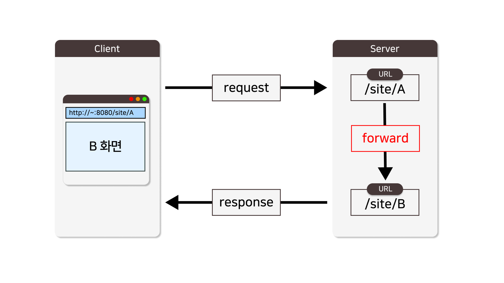
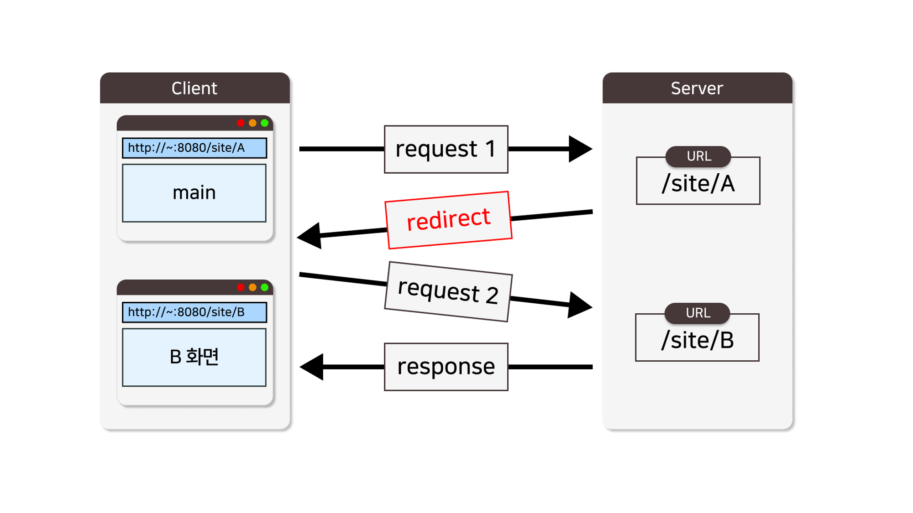

**<h5>04월 23일 Spring 7일차 수업3</h5>** <br>

# Spring Boot Response <br>

### 리다이렉트 <br>

    : 리다이렉트는 클라이언트의 요청을 다른 URL로 전송하는 기능을 말합니다. 
    이는 서버가 클라이언트의 요청을 받았지만, 해당 리소스가 다른 위치에 있거나 이동되었을 때 사용됩니다. 리다이렉트는 클라이언트가 원래 요청한 URL 대신에 새로운 URL로 이동하여 리소스를 얻을 수 있도록 도와줍니다. 이를 통해 웹 페이지의 경로를 변경하거나, 특정 페이지로의 리다이렉션을 설정할 수 있습니다.
<br>

### 페이지 이동 방식 <br>
    • forward
    
    • redirect

    웹 페이지를 이동하는 방식은 2가지로 나누어 볼 수 있다. 
<br>

### forward 방식 <br>



• 서버 내부에서 요청 경로 A 가 B 로 요청을 전달하며 페이지로 이동하는 방식 <br>

• 특징 <br>
    ◦ 원래의 요청 정보(request) 및 응답 정보(response)를 그대로 사용 <br>
    ◦ 클라이언트는 이동한 페이지 B 를 응답 받지만, 주소 표시줄의 요청 URL 은 그대로임 <br>
    ◦ 조회(읽기) 요청을 하는 경우에 주로 사용 <br>
<br>

### redirect 방식 <br>



• 서버가 요청 경로 A 로 요청을 받은 후, 클라이언트에게 B 로 다시 요청하라고 지시하며 페이지를 이동하는 방식 <br>

• 특징 <br>
    ◦ 클라이언트가 원래의 요청과 달리 완전히 다른 새로운 요청을 하여, 기존의 요청 정보는 이후의 요청에서는 사용할 수 없음 <br>
    ◦ 이동한 화면에서 주소 표시줄의 URL 이 A 에서 B 로 변화됨 <br>
    ◦ 등록, 수정, 삭제 요청 시에 주로 사용 <br>

<br>
<hr>

### 이미지 응답(썸네일) <br>

    - 이미지 응답 헤더
        • ContentType : image/*

            : 데이터가 이미지로 응답되려면 Content-Type 응답 헤더의 값을 image/*의 형태 지정해야합니다.

    - 일반적으로 이미지를 HTTP 응답으로 반환할 때 Content-Type 헤더는 image/*의 형태를 취하게 됩니다. 

    - 하지만 정확한 Content-Type 헤더는 해당 이미지 유형에 따라 달라집니다. 

    - 이미지 포맷에 따라 적절한 Content-Type을 설정해야 합니다.

    • JPEG 이미지의 Content-Type: image/jpeg
    • PNG 이미지의 Content-Type: image/png
    • GIF 이미지의 Content-Type: image/gif
    • WEBP 이미지의 Content-Type: image/webp
<br>

### 이미지 응답 방법 <br>
    • ResponseEntity<byte[]> 응답 타입으로 응답하기
    • HttpServletResponse, FileCopyUtils 객체를 이용하여 응답하기
<br>

```java
// ResponseEntity<byte[]> 응답 타입으로 응답하기
// ResponseEntity<byte[]>
/**
 * 🚀 ResponseEntity<byte[]>
 * @return
 * @throws IOException
 */
@GetMapping("/img")
public ResponseEntity<byte[]> thumbnailImg() throws IOException {
    log.info("[GET] - /img");

    // 이미지 파일을 읽어옴
    ClassPathResource imgFile = new ClassPathResource("sample.png");
    byte[] bytes = Files.readAllBytes(imgFile.getFile().toPath());

    // 이미지 파일을 읽어서 응답
    HttpHeaders headers = new HttpHeaders();
    headers.setContentType(MediaType.IMAGE_PNG);
    return new ResponseEntity<>(bytes, headers, HttpStatus.OK);
}

// HttpServletResponse, FileCopyUtils 객체를 이용하여 응답하기
// HttpServletResponse, FileCopyUtils
//  • Controller - showImg()
/**
	 * 이미지 썸네일 
	 * @param filePath
	 * @param response
	 * @throws Exception
	 */
	@GetMapping("/img")
	public void showImg(String filePath
					   ,HttpServletResponse response ) throws Exception {
		
		log.info("filePath : " + filePath);
		
		File file = new File(filePath);
		FileInputStream fis = new FileInputStream(file);
		ServletOutputStream sos = response.getOutputStream();
		FileCopyUtils.copy(fis, sos);

		// filePath  : C:/KHM/upload/[UID]_강아지.png
		// 이미지 컨텐트 타입 확인 ( .jpg, .png, .gif, ... )
		String ext = filePath.substring( filePath.lastIndexOf(".") + 1 );	// 확장자
		MediaType mType = MediaUtil.getMediaType(ext);
		
		// 이미지 타입이 아닐 경우
		if( mType == null ) {
			return;
		}
		
		log.info("mType : " + mType);
		response.setContentType( mType.toString() );
	}

```

<br>
<hr>

### HttpServletResponse <br>

    : HTTP 응답을 클라이언트에게 보내기 위한 HTTP 서블릿 응답을 나타냅니다.
     이 객체는 서블릿에서 클라이언트로 전송되는 응답을 제어하는 데 사용됩니다.

    1. HTTP 응답 설정: HTTP 응답의 속성 설정. 예를 들어, 콘텐츠 유형(Content-Type), 캐시 제어, 응답 코드 및 메시지 등을 설정할 수 있습니다.

    2. 응답 헤더 설정: HTTP 응답의 헤더 설정. setHeader() 메서드를 사용하여 특정 헤더 값을 설정할 수 있습니다.

    3. 쿠키 설정: 클라이언트로 쿠키를 전송하기 위해 addCookie() 메서드를 사용할 수 있습니다.
<br>

- 주요 메소드

|메소드|설명|
|---|---|
|setContentType(String type)|응답의 콘텐츠 유형을 설정합니다.|
|setStatus(int sc)|응답 코드를 설정합니다.|
|setHeader(String name, String value)|지정된 헤더 값을 설정합니다.|
|addCookie(Cookie cookie)|쿠키를 응답에 추가합니다.|
<br>

### FileCopyUtils <br>
    : Spring 프레임워크에서 파일 복사에 사용되는 유틸리티 클래스입니다. 이 클래스는 스트림 또는 리소스에서 파일을 읽고 쓰는 데 사용됩니다.
<br>

- 주요 메소드

|메소드|설명|
|---|---|
|copy()|파일, 스트림, 바이트 배열 등 간의 복사 작업을 수행합니다.|
|copy(byte[] in, byte[] out)|입력 byte[]에서 출력 byte[]로 데이터를 복사합니다.|
|copy(InputStream in, OutputStream out)|InputStream에서 OutputStream으로 데이터를 복사합니다.|
|copy(Resource in, File out)|Resource에서 File로 데이터를 복사합니다.|
<br>

<hr>

### 파일 응답 (다운로드) <br>

    - 파일 다운로드 응답 헤더
    • Content-Type : application/octet-stream   
    • Content-Disposition : form-data; name="attachment"; filename="sample.png”

- 파일 다운로드를 위해, Content-Type 응답 헤더의 값을 application/
octet-stream 의 형태 지정해야합니다. 

- Content-Disposition 응답 헤더의 값을 name="attachment"; filename="sample.png” 형태로 지정해야합니다.
<br>

### 파일 다운로드 구현 방법 <br>
    • ResponseEntity<byte[]> 응답 타입으로 응답하기
    • HttpServletResponse, FileCopyUtils 객체를 이용하여 응답하기
<br>

```java
// ResponseEntity<byte[]>
//    • Content-Type : application/octet-stream   
//    • Content-Disposition : form-data; name="attachment"; filename="sample.png”
/**
 * 🚀 ResponseEntity<byte[]>
 * @return
 * @throws IOException
 */
@GetMapping("/img")
public ResponseEntity<byte[]> thumbnailImg() throws IOException {
    log.info("[GET] - /img");

    // 이미지 파일을 읽어옴
    ClassPathResource imgFile = new ClassPathResource("sample.png");
    byte[] bytes = Files.readAllBytes(imgFile.getFile().toPath());

    // 이미지 파일을 읽어서 응답
    HttpHeaders headers = new HttpHeaders();
    headers.setContentType(MediaType.IMAGE_PNG);
    return new ResponseEntity<>(bytes, headers, HttpStatus.OK);
}

// HttpServletResponse, FileCopyUtils
/**
	 * 파일 다운로드
	 * @param fileNo
	 * @param response
	 * @throws Exception
	 */
	@GetMapping("/{fileNo}")
	public void fileDownload(@PathVariable("fileNo") int fileNo
							,HttpServletResponse response) throws Exception {
		
		// 파일 조회
		Files file = fileService.read(fileNo);
		
		// 파일이 존재하지 않으면,
		if( file == null ) {
			// 응답 상태코드 : 400, 클라이언트의 요청이 잘못되었음을 나타내는 상태코드
			response.setStatus(response.SC_BAD_REQUEST);
			return;
		}
		
		String fileName = file.getFileName();	// 파일 명
		String filePath = file.getFilePath();	// 파일 경로
		
		// 파일 다운로드를 위한 헤더 세팅
		// - ContentType 			: application/octet-straem
		// - Content-Disposition 	: attachment; fileanme="파일명.확장자"
		response.setContentType("application/octet-stream");
		response.setHeader("Content-Disposition", "attachment; filename=\"" + fileName + "\"");
		
		
		// 파일 입력
		File downloadFile = new File(filePath);
		FileInputStream fis = new FileInputStream(downloadFile);
		ServletOutputStream sos = response.getOutputStream();

		// 다운로드
		FileCopyUtils.copy(fis, sos);
		
	}
```