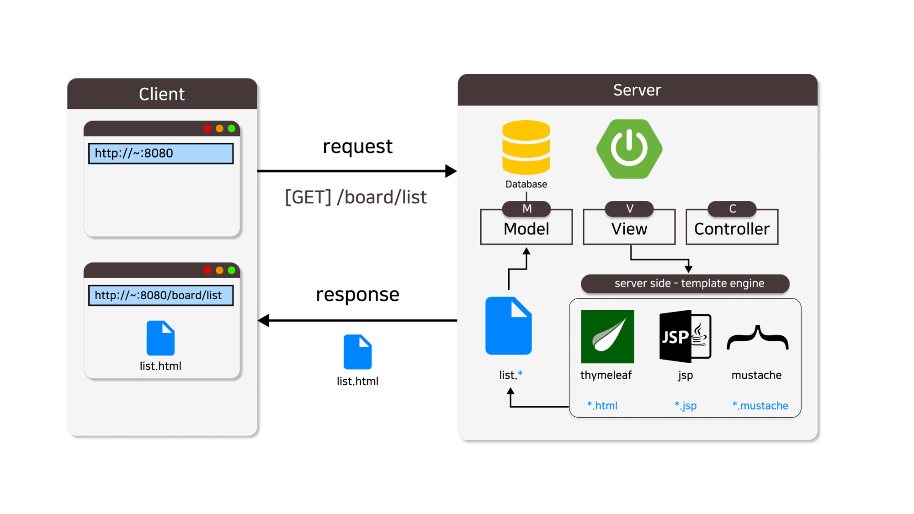
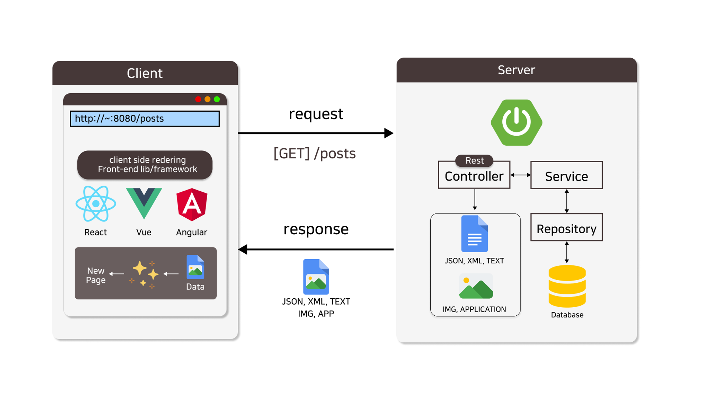
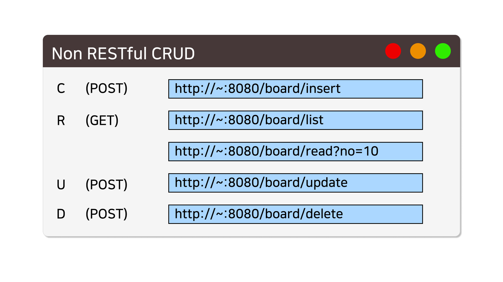
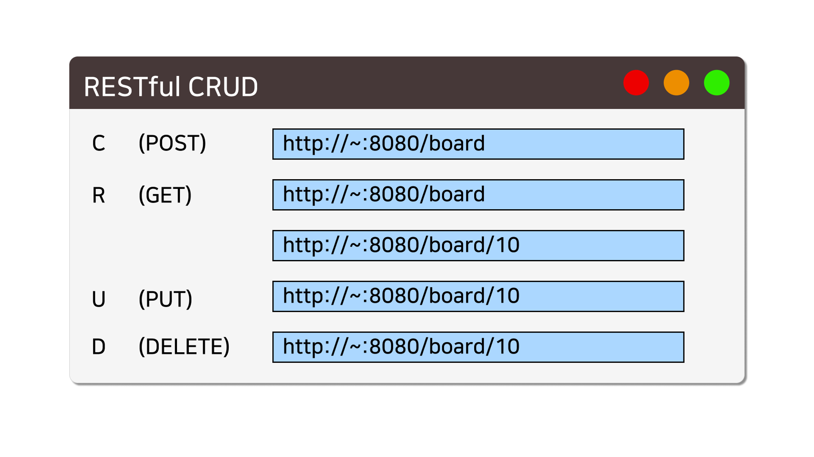

**<h5>04월 25일 Spring 9일차 수업1</h5>** <br>

# REST, Representational State Transfer <br>
    : 상태 표현 전송 아키텍처

### REST란? <br>
    : 자원의 상태를 표현하여 전달하는 아키텍처
    
    URI 로 자원을 대신하여 표현하고, 서버가 해야 할 행위(서버의 상태)를 HTTP 메소드로 표현하는 것을 원칙으로 하는 아키텍처

    • 네트워크 아키텍처 중의 하나입니다.
    • 프론트엔드 및 백엔드의 독립성과 확장성 향상시킵니다.
<br>


### RESTful API의 장점 <br>
    • 간결성: 직관적이고 간결한 인터페이스를 제공합니다.

    • 확장성: 시스템을 느슨하게 결합하여 확장이 용이합니다.

    • 가시성: 자원에 대한 표준화된 인터페이스를 제공하므로, 개발자들이 API를 이해하고 사용하기 쉽습니다.
<br>

- RESTful : REST 아키텍처를 따르는 시스템 또는 서비스를 가리키는 용어입니다
<br>

- RESTful API
    : REST 아키텍처 원칙을 따르는 API로, RESTful 서비스를 위한 인터페이스입니다. 이 API는 웹 서비스를 구축하거나 통합하는 데 사용됩니다. 

    주로 HTTP를 기반으로 하며, 자원을 URL로 표현하고 HTTP 메소드(GET, POST, PUT, DELETE 등)를 사용하여 자원을 관리하며, JSON 또는 XML과 같은 데이터 형식을 통해 데이터를 교환합니다. 
    
    RESTful API는 간단하고 직관적이며, 서버와 클라이언트 사이의 통신을 효율적으로 수행하는 데 도움이 됩니다
<br>

### CRUD <br>
    :CRUD는 데이터의 기본적인 작업을 나타내는 약어로, Create(생성), Read(읽기), Update(수정), Delete(삭제)의 네 가지 기본 작업을 말합니다. 이 네 가지 작업은 주로 데이터베이스와 관련된 작업에서 사용됩니다:
<br>

### RESTful CRUD <br>

|CRUD 작업|요청 메소드|설명|
|---|---|---|
|Create|POST|새로운 데이터 레코드를 생성|
|Read|GET|데이터를 읽거나 조회|
|Update|PUT/PATCH|데이터 레코드를 수정 또는 갱신|
|Delete|DELETE|데이터를 삭제|
<br>

RESTful API는 이러한 HTTP 메소드를 사용하여 서버의 자원을 관리하는 데 활용됩니다. <br>

예를 들어, POST 요청을 통해 새로운 데이터를 생성하고, GET 요청을 통해 데이터를 읽거나 조회하며, PUT 또는 PATCH 요청을 통해 데이터를 수정하고, DELETE 요청을 통해 데이터를 삭제할 수 있습니다. <br>

이러한 HTTP 메소드를 이용하여 각각의 CRUD 작업을 수행하는 것이 RESTful API의 주요 특징 중 하나입니다. <br>

<br>

### REST 아키텍처를 사용하는 이유 <br>

    RESTful API는 일반적으로 HTTP 프로토콜을 따르고, 요청과 응답을 표준화된 방식으로 처리함으로써, 다양한 언어나 플랫폼 간에 상호운용성을 보장합니다. 
    
    이는 프론트엔드와 백엔드를 분리하고, 각 영역을 독립적으로 개발할 때 매우 유용합니다. 
    
    따라서 프론트엔드와 백엔드를 독립적으로 개발하는 경우 RESTful API를 사용하는 것이 일반적으로 권장됩니다.

    REST 는 네트워크 아키텍처의 일종입니다.
<br>

### 주요 네트워크 아키텍처 종류 <br>
    1. 계층화된 아키텍처(Layered Architecture)
        : 네트워크 시스템이 여러 계층으로 구성되어 있으며, 각 계층은 특정한 역할과 책임을 갖습니다. OSI 7계층 모델이 이러한 계층화 아키텍처의 한 예입니다.

    2.RESTful 아키텍처(Representational State Transfer)
        : REST는 클라이언트와 서버 간의 통신을 위한 웹 아키텍처의 한 형태로, 리소스를 URL을 통해 식별하고 HTTP 메소드를 사용하여 리소스에 접근하는 아키텍처 원칙입니다.

    3. 마이크로서비스 아키텍처(Microservices Architecture)
        : 이 아키텍처는 애플리케이션을 여러 작은 서비스로 분할하여 각 서비스가 독립적으로 구성되고 실행되도록 하는 구조를 말합니다.
<br>

### Server Side Rendering (SSR) <br>
    서버 측 렌더링(Server-Side Rendering, SSR)은 사용자가 웹페이지에 접속했을 때, 
    서버에서 해당 페이지를 완전히 렌더링하고 완성된 HTML 문서로 클라이언트에게 제공하는 
    기술입니다. 
    클라이언트에서는 서버로부터 전달된 완성된 HTML을 받아 화면에 표시하는 방식입니다.
<br>



<br>
<hr>
<br>

### Client Side Rendering (CSR) <br>
    클라이언트 측 렌더링 (Client-Side Rendering 또는 CSR)은 웹 애플리케이션을 사용자의 브라우저에서 JavaScript를 사용하여 완전히 렌더링하는 프로세스를 의미합니다. 이 방식은 웹 애플리케이션의 정적 파일을 로드하고 사용자 상호 작용에 따라 API에서 데이터를 가져와 DOM을 조작하여 내용을 동적으로 표시합니다.

    CSR(Client-Side Rendering)에서는 주로 JSON 또는 XML과 같은 데이터를 받아 자바스크립트로 렌더링하고, React, Vue, Angular 등의 프레임워크 또는 라이브러리를 사용하여 클라이언트 측에서 웹 애플리케이션의 렌더링을 담당합니다. 페이지 로딩 후, 프론트엔드 라이브러리가 서버에서 받은 데이터를 동적으로 렌더링하여 사용자에게 보여줍니다. 이 과정은 클라이언트 측에서 이루어지므로 브라우저에서 빠르게 화면을 표시할 수 있습니다.



<br>
<hr>
<br>

### Non-RESTful 시스템 <br>

    Non-RESTful 시스템은 REST 아키텍처의 원칙을 따르지 않는 시스템을 의미합니다. 이러한 시스템은 REST의 기본 원칙 중 일부 또는 전혀 적용되지 않을 수 있습니다.

    비RESTful 시스템에서는 자원을 URI로 표현하는 것이 불명확하거나 일관성이 없을 수 있습니다. 또한, HTTP 메서드를 올바르게 사용하지 않거나, Hypermedia를 활용하지 않는 등 REST 아키텍처에서 규정한 원칙을 따르지 않는 특성을 보일 수 있습니다.
<br>



<br>
<hr>
<br>

### RESTful 시스템 <br>
    RESTful 시스템은 REST의 기본 원칙인 자원 식별, 자기서술형 메시지, HATEOAS(하이퍼미디어 제어 상태) 등을 적용하는 시스템을 가리킵니다. 
    
    이러한 시스템은 일관된 URI, HTTP 메소드의 사용, Hypermedia의 적극적인 활용과 같은 REST 아키텍처의 원칙을 따르며, 이를 통해 확장성과 유지보수성이 향상됩니다.



<br>
<hr>
<br>

### REST 아키텍처의 6가지 원칙 <br>
    1. 인터페이스 일관성 (Uniform Interface)
    2. 무상태 (Stateless)
    3. 캐싱 가능 (Cacheable)
    4. 계층화 (Layered System)
    5. Code on Demand
    6. 클라이언트/서버 구조 (Client/Server Architecture)
<br>
<hr>

1. #### 인터페이스 일관성 (Uniform Interface) : 일관적인 인터페이스로 분리되어야 한다.

    REST 인터페이스는 일관성을 가져야 합니다. 이는 리소스에 접근하는 방법이 일관되어야 함을 의미합니다. 리소스에 대한 정보는 리소스 식별자와 함께 요청되며, 서버는 리소스 상태를 클라이언트에게 전달합니다.
    
<hr>
<br>

2. #### 무상태 (Stateless) : 각 요청 간 클라이언트의 콘텍스트가 서버에 저장되어서는 안 된다

    요청 간 상태 정보를 유지하지 않는 원칙입니다. 각 요청은 그 요청 자체에 필요한 모든 정보를 포함해야 하며, 서버는 각 요청을 별개의 요청으로 취급해야 합니다.

<hr>
<br>

3. #### 캐싱 가능 (Cacheable) : WWW에서와 같이 클라이언트는 응답을 캐싱할 수 있어야 한다.

    클라이언트는 응답을 캐싱할 수 있어야 합니다. 서버는 응답에 캐시 제어 헤더를 추가하여 캐싱 동작을 조절할 수 있습니다.

    캐싱은 자주 사용되는 데이터를 미리 저장해두고 필요할 때마다 빠르게 사용하도록 하는 기술입니다.

<hr>
<br>

4. #### 계층화 (Layered System) : 클라이언트는 대상 서버에 직접 연결되었는지, 연결되었는지를 알 수 없다.

    REST는 계층화된 구조를 가집니다. 서버는 다양한 계층으로 나뉘어 있으며, 클라이언트는 서버와 직접 통신하지만, 실제 서버가 처리되는 위치를 알 필요가 없습니다.

<hr>
<br>

5. #### Code on Demand : 서버가 클라이언트가 실행시킬 수 있는 로직을 전송하여 기능을 확장시킬 수 있다.

    "Code on Demand"는 리소스가 서버에서 클라이언트로 보내지는 동안에 클라이언트에게 실행 가능한 코드를 전송하여, 클라이언트가 실행할 수 있는 기능을 확장하는 원칙을 가리킵니다.  클라이언트는 이 코드를 실행할 수 있어야 하며, 일반적으로 JavaScript가 가장 일반적인 사용 사례입니다.

<hr>
<br>

6. #### 클라이언트/서버 구조 (Client/Server Architecture) : 클라이언트-서버의 각 파트가 독립적으로 개선될 수 있도록 해준다.

    REST는 클라이언트와 서버가 분리되어야 한다는 원칙입니다. 서버는 데이터 저장, 관리, 백엔드 로직을 처리하고, 클라이언트는 사용자 인터페이스를 제공하고 사용자 요청을 서버로 전송합니다.

<hr>
<br>


### REST 아키텍처의 URL 명명 규칙 <br>

    - 명사 사용
        : URL은 리소스를 나타내며, 리소스에 대한 동작은 HTTP 메서드를 통해 수행되므로, 명사를 사용하여 리소스를 나타내는 것이 좋습니다.

    - 복수형 사용
        : 리소스를 나타낼 때 복수형을 사용하는 것이 좋습니다. 예를 들어, /users, /posts와 같이 리소스 복수형을 사용합니다.

    -  하위 리소스를 위한 중첩 URL 사용
        : 관계가 있는 리소스의 경우, 중첩 URL 구조 (/super/sub) 를 사용하여 관계를 명확히 합니다.

    - 하이픈(-) 대신 언더스코어(_) 사용
        : 가독성을 높이고 식별을 쉽게 하기 위해 언더 스코어(_)를 사용하는 것이 좋습니다. 
        (단, 리소스 이름의 띄어쓰기는 하이픈(-) 사용)

    -  단순하고 직관적인 URL
        : URL은 리소스를 식별하는 데 사용되며, 이것은 직관적이고 명확해야 합니다. 하나의 리소스에 하나의 URL 을 대응하는 것이 좋으며 파일 확장자 (.html, .jsp 등)를 사용하지 않습니다.
<br>
<hr>
<br>

### 스프링부트로 RESTful API 구현하기 <br>
    1. @RestController 클래스 정의
    2. GET, POST, PUT, DELETE 컨트롤러 메소드 정의
<br>

```java
/** @RestController 클래스 정의
 * 🟢 RestFul
 * 게시판 컨트롤러
 * - 게시글 목록            - [GET] - /board
 * - 게시글 조회            - [GET] - /board/10
 * - 게시글 등록 처리       - [POST] - /board
 * - 게시글 수정 처리       - [PUT] - /board
 * - 게시글 삭제 처리       - [DELETE] - /board/10
 */
@Slf4j
@RestController
@RequestMapping("/posts") 
public class RestBoardController {


}


// GET, POST, PUT, DELETE 컨트롤러 메소드 정의
/*  • 게시글 목록               - [GET] - /board
    • 게시글 조회               - [GET] - /board/10
    • 게시글 등록 처리          - [POST] - /board
    • 게시글 수정 처리          - [PUT] - /board
    • 게시글 삭제 처리          - [DELETE] - /board/10
*/   

/**
 * 게시글 목록
 * [GET]
 * /board
 * response : boardList
 * @return
 */
@GetMapping()
public ResponseEntity<?> findAll() {
    log.info("[GET] - /board");
    try {
        List<Board> boardList = boardService.list();
        return new ResponseEntity<>(boardList, HttpStatus.OK);
    } catch (Exception e) {
        return new ResponseEntity<>(HttpStatus.INTERNAL_SERVER_ERROR);
    }
}

/**
 * 게시글 조회
 * [GET]
 * /board/{id}
 * request  : id
 * response : board
 * @param id - 게시글 번호
 * @return
 */
@GetMapping("/{id}")
public ResponseEntity<?> find(@PathVariable Integer id) {
    log.info("[GET] - /board/" + id);
    try {
        Board board = boardService.select(id);
        return new ResponseEntity<>(board, HttpStatus.OK);
    } catch (Exception e) {
        return new ResponseEntity<>(HttpStatus.INTERNAL_SERVER_ERROR);
    }
}

/**
 * 게시글 등록
 * [POST]
 * /board
 * request  : board 
 * response : ⭕, ❌
 * @param board
 * @return
 */
@PostMapping()
public ResponseEntity<?> create(@RequestBody Board board) {
    log.info("[POST] - /board");
    try {
        int result = boardService.insert(board);
        if( result == 0 )
            return ResponseEntity.badRequest().build();
        return new ResponseEntity<>("CREATED", HttpStatus.CREATED);
    } catch (Exception e) {
        return new ResponseEntity<>(HttpStatus.INTERNAL_SERVER_ERROR);
    }
}

/**
 * 게시글 수정
 * [PUT]
 * /board
 * request  : board 
 * response : ⭕, ❌
 * @param board
 * @return
 */
@PutMapping()
public ResponseEntity<?> update(@RequestBody Board board) {
    log.info("[PUT] - /board");
    try {
        int result = boardService.update(board);
        if( result == 0 )
            return ResponseEntity.badRequest().build();
        return new ResponseEntity<>("UPDATED", HttpStatus.OK);
    } catch (Exception e) {
        return new ResponseEntity<>(HttpStatus.INTERNAL_SERVER_ERROR);
    }
}

/**
 * 게시글 삭제
 * [DELETE]
 * /board/{id}
 * request  : id
 * response : ⭕, ❌
 * @param id
 * @return
 */
@DeleteMapping("/{id}")
public ResponseEntity<?> delete(@PathVariable Integer id) {
    log.info("[DELETE] - /board/" + id);
    try {
        int result = boardService.delete(id);
        if( result == 0 )
            return ResponseEntity.badRequest().build();
        return ResponseEntity.ok().build();
    } catch (Exception e) {
        return new ResponseEntity<>(HttpStatus.INTERNAL_SERVER_ERROR);
    }
}

```