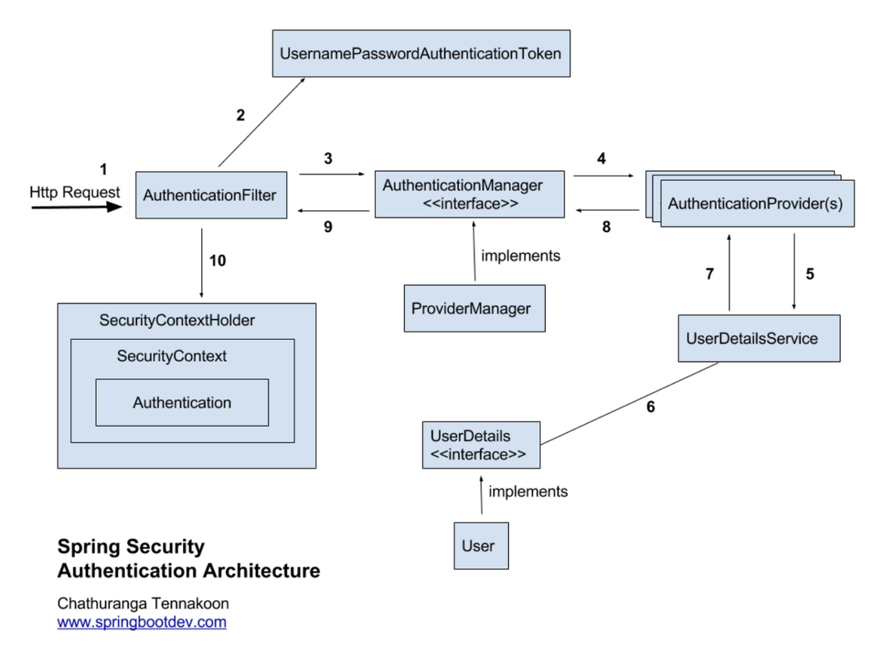
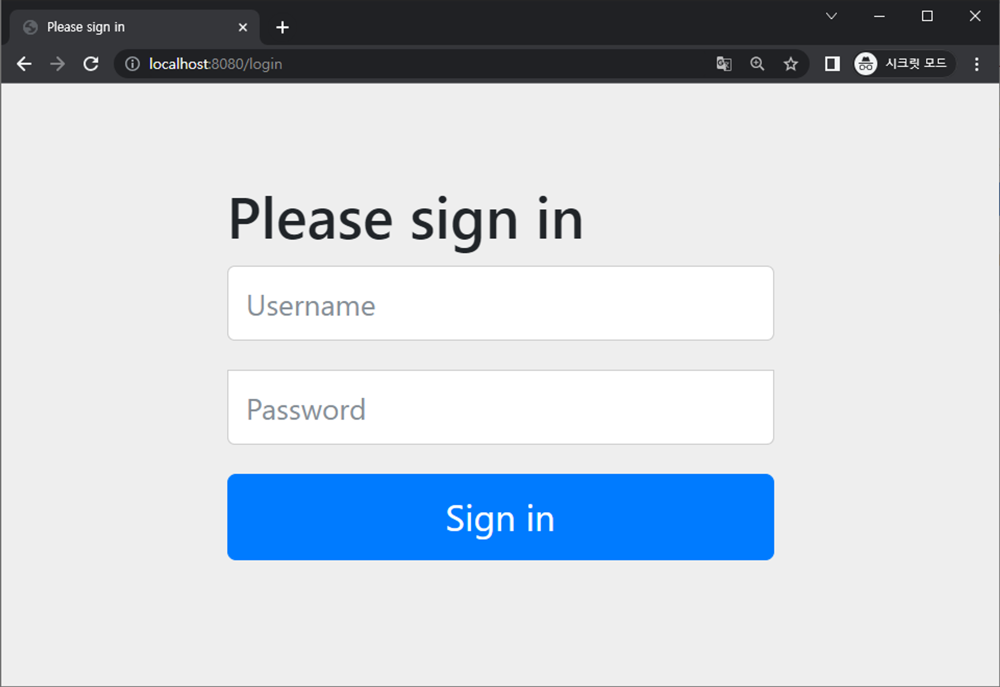
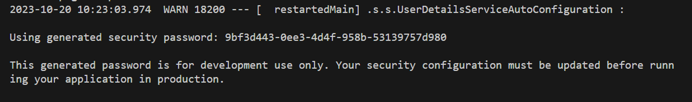
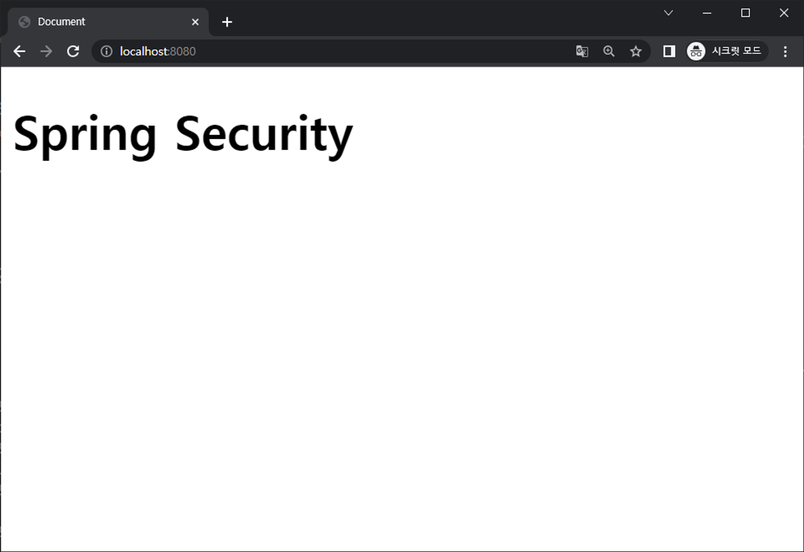

##### 2024-05-07 Spring Security 수업내용1

# Spring Security <br>
    : 스프링 시큐리티는 스프링 기반 애플리케이션의 인증과 권한 부여를 담당하는 프레임워크입니다. 
    
    이를 사용하여 애플리케이션의 보안을 강화하고 사용자 인증, 접근 제어, 권한 관리 등을 구현할 수 있습니다. 

    스프링 시큐리티는 다양한 인증 방식과 보안 기능을 제공하며, 커스터마이징이 가능하여 다양한 요구사항에 맞게 사용할 수 있습니다.
<br>



1. AuthenticationFilter: <br>
    • AuthenticationFilter는 Spring Security 필터 체인에서 인증을 처리하는 역할을 담당합니다. <br>
    • 사용자가 인증 자격 증명(일반적으로 사용자 이름 및 비밀번호)을 제출하면 이 필터가 사용자를 인증합니다. <br>
<br>
 
2. UsernamePasswordAuthenticationToken: <br>
    • UsernamePasswordAuthenticationToken은 사용자 이름과 비밀번호를 포함하는 Authentication의 구체적인 구현입니다. 주로 폼 기반 로그인에서 사용됩니다. <br>
<br>

3. AuthenticationManager: <br>
    • AuthenticationManager는 실제로 사용자를 인증하는 인터페이스입니다. <br>
    • 주어진 Authentication 객체를 기반으로 사용자를 인증하고 Authentication 객체를 반환합니다. <br>
<br>

4. ProviderManager: <br>
    • ProviderManager는 기본 AuthenticationManager 구현 중 하나로, 여러 개의 AuthenticationProvider를 관리하고 이를 사용하여 사용자를 인증합니다. <br>
<br>

5. AuthenticationProvider: <br>
    • AuthenticationProvider는 실제로 인증을 수행하는 객체입니다. <br>
    • 사용자가 제출한 자격 증명을 검증하고 Authentication 객체를 반환합니다. <br>
    • Spring Security는 다양한 인증 프로바이더를 지원하며, 대표적으로 DaoAuthenticationProvider, LdapAuthenticationProvider, OpenIDAuthenticationProvider 등이 있습니다. <br>
<br>

6. UserDetailsService: <br>
    • UserDetailsService는 사용자 정보를 로드하는 인터페이스입니다. <br>
    • 사용자의 식별자(일반적으로 사용자 이름)를 기반으로 사용자 정보를 가져옵니다. <br>
<br>

7. UserDetails: <br>
    • UserDetails는 사용자의 정보를 담는 인터페이스로, 사용자 이름, 비밀번호, 권한 등의 정보를 포함합니다. <br>
    • 사용자 정보를 UserDetailsService로부터 로드할 때 사용됩니다. <br>
<br>

8. User: <br>
    • User는 Spring Security에서 기본적으로 제공하는 UserDetails의 구현 클래스 중 하나입니다. <br>
    • 사용자의 기본 정보를 저장하며, 사용자 이름, 비밀번호, 권한을 포함합니다. <br>
<br>

9. SecurityContextHolder: <br>
    • SecurityContextHolder는 현재 사용자의 SecurityContext를 관리하는 유틸리티 클래스입니다. <br>
    • 현재 사용자의 Authentication 객체를 저장하고 관리합니다. <br>
<br>

10. SecurityContext: <br>
    • SecurityContext는 현재 사용자의 보안 정보를 저장하는 컨테이너입니다. <br>
    • SecurityContextHolder를 사용하여 현재 사용자의 SecurityContext를 설정하고 얻을 수 있습니다. <br>
<br>

11. Authentication 클래스: <br>
    • Authentication 클래스는 Spring Security에서 사용자의 인증 정보와 권한 정보를 포함하는 클래스입니다. <br>
    • Authentication 객체를 통해 현재 사용자의 인증 상태 및 권한을 확인할 수 있습니다. <br>
<br>

<hr>
<br>

### 스프링 시큐리티 요청 흐름 <br>
1. 사용자가 웹 애플리케이션에 로그인을 시도합니다. <br>
<br>

2. 로그인 폼에서 사용자가 사용자 이름과 비밀번호를 제출하면, 이 정보는 Spring Security AuthenticationFilter로 전달됩니다. <br>
<br>

3. AuthenticationFilter는 UsernamePasswordAuthenticationToken을 생성하고, 사용자 이름과 비밀번호를 이 토큰에 포함시킵니다. <br>
<br>

4. 이 토큰은 AuthenticationManager로 전달됩니다. <br> 
AuthenticationManager는 ProviderManager를 포함하며, 다양한 AuthenticationProvider를 관리합니다. <br>
<br>

5. ProviderManager는 등록된 AuthenticationProvider들을 순회하면서 토큰을 검증하는 시도를 합니다. <br>
각 AuthenticationProvider는 다양한 방식으로 사용자를 인증할 수 있습니다. <br>
일반적으로 사용자 이름/비밀번호를 검증하는 DaoAuthenticationProvider를 사용합니다. <br>
<br>

6. DaoAuthenticationProvider는 사용자 이름을 기반으로 데이터베이스 또는 다른 저장소에서 사용자 정보를 가져오고, 비밀번호 검증을 수행합니다. <br>
만약 사용자가 유효하면 Authentication 객체를 생성하고 반환합니다. <br>
<br>

7. AuthenticationManager는 검증된 Authentication 객체를 다시 AuthenticationFilter로 반환합니다. <br>
<br>

8. AuthenticationFilter는 사용자의 Authentication 객체를 SecurityContextHolder에 저장합니다. <br>
이렇게 하면 현재 사용자의 보안 컨텍스트가 설정됩니다.<br>
<br>

9. 사용자가 인증된 후, Spring Security는 요청을 계속 진행시킵니다. <br>
사용자는 해당 리소스에 대한 권한이 있는지 확인하기 위해 권한 부여(Authorization) 단계로 이동하게 됩니다. <br>
<br>

10. 요청된 리소스에 액세스할 때, Spring Security는 @PreAuthorize, @PostAuthorize, @Secured 등과 같은 애노테이션을 사용하여 메서드 레벨에서 권한을 확인하고, 사용자에게 액세스 권한이 있는지 확인합니다.<br> 
<br>

11. 요청된 작업이 사용자에게 허용된 경우, 리소스에 대한 요청은 성공하고 응답이 클라이언트에게 반환됩니다.
<br><br> 

12. 만약 권한이 없는 경우, 액세스가 거부되며, 클라이언트는 적절한 오류 메시지나 리디렉션을 받게 됩니다. 
<br><br>


<hr>

### 스프링 시큐리티 설정
    - 의존성 설정
    - 기본 설정
<br>

### 의존성 설정
    - build.gradle 설정 스프링 시큐리티 5버전 사용 
<br>

```java
plugins {
	id 'java'
	id 'war'
	id 'org.springframework.boot' version '2.7.17'
	id 'io.spring.dependency-management' version '1.0.15.RELEASE'
}

group = 'com.joeun'
version = '0.0.1-SNAPSHOT'

java {
	sourceCompatibility = '17'
}

configurations {
	compileOnly {
		extendsFrom annotationProcessor
	}
}

repositories {
	mavenCentral()
}

dependencies {
	implementation 'org.springframework.boot:spring-boot-starter-security'
	implementation 'org.springframework.boot:spring-boot-starter-thymeleaf'
	implementation 'org.springframework.boot:spring-boot-starter-web'
	implementation 'org.mybatis.spring.boot:mybatis-spring-boot-starter:2.3.1'
	implementation 'org.thymeleaf.extras:thymeleaf-extras-springsecurity5'
	compileOnly 'org.projectlombok:lombok'
	developmentOnly 'org.springframework.boot:spring-boot-devtools'
	runtimeOnly 'com.mysql:mysql-connector-j'
	annotationProcessor 'org.projectlombok:lombok'
	providedRuntime 'org.springframework.boot:spring-boot-starter-tomcat'
	testImplementation 'org.springframework.boot:spring-boot-starter-test'
	testImplementation 'org.mybatis.spring.boot:mybatis-spring-boot-starter-test:2.3.1'
	testImplementation 'org.springframework.security:spring-security-test'
}

tasks.named('test') {
	useJUnitPlatform()
}
```

<br>

### 기본 설정 <br>
    아무 설정 없이 접속하게 되면, 인증을 하기 위해서, login 페이지로 이동합니다.
    그리고, 스프링 시큐리티를 포함한 스프링 부트 프로젝트가 실행될 때는, 개발용으로만 제공되는 “generated security password” 가 로그에 출력됩니다. 기본 아이디(username)와 기본 패스워드(generated password) 를 사용하여 로그인 인증 테스트를 할 수 있습니다.

• 기본 아이디     :  user
• 기본 패스워드 :  Using generated security password :  ??????????
 -> 스프링 부트 실행 시 TERMINAL에서 확인할 수 있다.




<br>

- 인증 성공 시 아래와 같이 메인 페이지로 이동



<hr>

### 스프링 시큐리티의 기능 <br>
    • 인증 (Authentication):
    • 인가; 권한 관리 (Authorization):
    • CSRF (Cross-Site Request Forgery) 방어
    • 사용자 지정 필터 및 이벤트 핸들러
    • 자동 로그인 (Remember-Me)
<br>

### 인증 & 인가 <br>
    - 인증 (Authentication) : 
        스프링 시큐리티에서 인증은 등록된 사용자인지 확인하여 입증하는 과정입니다. 사용자는 기본 아이디와 기본 패스워드를 사용하여 로그인하여 인증을 테스트할 수 있습니다. 

    - 인가 (Authorization)
        스프링 시큐리티에서 인가는 사용자의 권한을 확인하여 권한에 따라 자원의 사용범위를 구분하여 허락하는 과정입니다.

### 스프링 시큐리티 주요 인증 방식 <br>

    • 인메모리 인증 방식
    • JDBC 인증 방식
    • 사용자 정의 인증 방식

```java 
// SecurityCofing.java 설정 파일
// 이 메소드는 Spring Security에서 사용자 인증을 설정하고 구성하는 역할을 합니다.

@EnableWebSecurity              // 해당 클래스를 스프링 시큐리티 설정 빈으로 등록
public class SecurityConfig extends WebSecurityConfigurerAdapter {
		
		// 👮‍♂️🔐사용자 인증 관리 메소드
		@Override
		protected void configure(AuthenticationManagerBuilder auth) throws Exception {
		
		
		}
}
```
- @EnableWebSecurity
    이 어노테이션은 해당 클래스를 스프링 시큐리티 설정용 빈으로 등록하며, 스프링 부트 애플리케이션에서 자동으로 감지됩니다.
<br>

- WebSecurityConfigurerAdapter
    이 클래스를 확장함으로써 보안 설정을 구성할 준비가 됩니다. WebSecurityConfigurer 인터페이스의 구현체이며, 여러 메소드를 오버라이드하여 웹 보안을 정의할 수 있게 합니다.
<br>

- configure(AuthenticationManagerBuilder auth)
    이 메소드는 사용자 인증을 구성하는 역할을 합니다. 사용자 스토어 설정, 패스워드 인코딩, 사용자 권한 등을 설정할 수 있습니다.
<br>

<hr>

### 인메모리 인증 방식 <br>

```java
// WebConfig.java
@Configuration          // 빈 등록 설정 클래스 지정
public class WebConfig {

    @Bean                   // 빈 등록
    public PasswordEncoder passwordEncoder() {
        return new BCryptPasswordEncoder();
        // return NoOpPasswordEncoder.getInstance();
        // BCryptPasswordEncoder        : BCrypt 해시 알고리즘을 사용하여 비밀번호 암호화 
        // NoOpPasswordEncoder          : 암호화 없이 비밀번호를 저장
        // ...
    }    
/**
 * SecurityConfig.java 에서 의존 주입받고 있는 PasswordEncoder 에 대한 빈 등록을 합니다. 
 * 이때 *NoOpPasswordEncoder 구현 클래스로 지정하면 비밀번호를 암호화하지 않고, 
 * BCryptPasswordEncoder 구현 클래스를 지정하면 Bcrypt 해시 알고리즘을 사용하여 비밀번호를 
 * 암호화합니다.
 */
}

////////////////////////////////////////////////////////////////////////////////////
// SecurityConfig.java
@EnableWebSecurity              // 해당 클래스를 스프링 시큐리티 설정 빈으로 등록
public class SecurityConfig extends WebSecurityConfigurerAdapter {

		@Autowired
    private PasswordEncoder passwordEncoder;        // 비밀번호 암호화 객체
		
		/**
     * 👮‍♂️🔐사용자 인증 관리 메소드
     * ⭐ 인메모리 인증 방식
     */
    @Override
    protected void configure(AuthenticationManagerBuilder auth) throws Exception {
        // AuthenticationManagerBuilder : 인증 관리 객체
        auth.inMemoryAuthentication()               
            // .withUser("아이디").password("비밀번호").roles("권한")
            // passwordEncoder.encode("비밀번호")     :   비밀번호 암호화
            // BCryptPasswordEncoder 사용
            .withUser("user").password(passwordEncoder.encode("123456")).roles("USER")
            .and()
            .withUser("admin").password(passwordEncoder.encode("123456")).roles("ADMIN")
            ;
            // NoOpPasswordEncoder 사용
            // .withUser("user").password("123456").roles("USER")
            // .and()
            // .withUser("admin").password("123456").roles("ADMIN")
            // ;
    }
/*
 * auth.inMemoryAuthentication() : 인메모리 방식으로 사용자 인증 설정을 시작합니다.
 * 
 * withUser(”user”) : 사용자 "user"를 추가합니다.
 * 
 * password(passwordEncoder.encode("123456")) : 사용자 "user"의 패스워드를 설정하고,
 * passwordEncoder.encode()를 사용하여 패스워드를 암호화합니다.
 * 
 * roles("USER") : 사용자 "user"에게 "USER" 권한을 부여합니다.
 * 
 * ROLE_ 스프링 시큐리티 권한 접두사  
 * - Spring Security에서는 기본적으로 "ROLE_" 접두사를 자동으로 추가하여 권한을 관리합니다. 
 * 이것은 Spring Security의 표준 규칙 중 하나이며, 사용자에게 부여된 권한을 확인할 때 "ROLE_"
 *  접두사가 필요합니다.
*/
}


```

JDBC 인증 방식
 여기서 부터