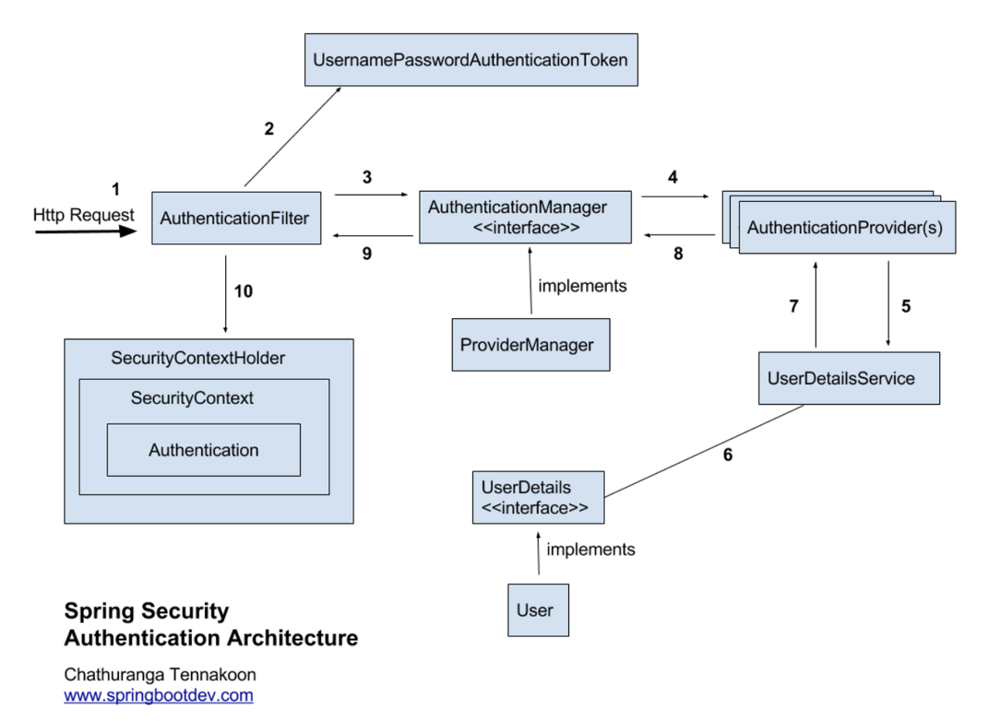

##### 2024-05-07 Spring Security 수업내용1

# Spring Security  
    : 스프링 시큐리티는 스프링 기반 애플리케이션의 인증과 권한 부여를 담당하는 프레임워크입니다. 
    
    이를 사용하여 애플리케이션의 보안을 강화하고 사용자 인증, 접근 제어, 권한 관리 등을 구현할 수 있습니다. 

    스프링 시큐리티는 다양한 인증 방식과 보안 기능을 제공하며, 커스터마이징이 가능하여 다양한 요구사항에 맞게 사용할 수 있습니다.
 

1. AuthenticationFilter:  
    • AuthenticationFilter는 Spring Security 필터 체인에서 인증을 처리하는 역할을 담당합니다.  
    • 사용자가 인증 자격 증명(일반적으로 사용자 이름 및 비밀번호)을 제출하면 이 필터가 사용자를 인증합니다.  
 
 
2. UsernamePasswordAuthenticationToken:  
    • UsernamePasswordAuthenticationToken은 사용자 이름과 비밀번호를 포함하는 Authentication의 구체적인 구현입니다. 주로 폼 기반 로그인에서 사용됩니다.  
 

3. AuthenticationManager:  
    • AuthenticationManager는 실제로 사용자를 인증하는 인터페이스입니다.  
    • 주어진 Authentication 객체를 기반으로 사용자를 인증하고 Authentication 객체를 반환합니다.  
 

4. ProviderManager:  
    • ProviderManager는 기본 AuthenticationManager 구현 중 하나로, 여러 개의 AuthenticationProvider를 관리하고 이를 사용하여 사용자를 인증합니다.  
 

5. AuthenticationProvider:  
    • AuthenticationProvider는 실제로 인증을 수행하는 객체입니다.  
    • 사용자가 제출한 자격 증명을 검증하고 Authentication 객체를 반환합니다.  
    • Spring Security는 다양한 인증 프로바이더를 지원하며, 대표적으로 DaoAuthenticationProvider, LdapAuthenticationProvider, OpenIDAuthenticationProvider 등이 있습니다.  
 

6. UserDetailsService:  
    • UserDetailsService는 사용자 정보를 로드하는 인터페이스입니다.  
    • 사용자의 식별자(일반적으로 사용자 이름)를 기반으로 사용자 정보를 가져옵니다.  
 

7. UserDetails:  
    • UserDetails는 사용자의 정보를 담는 인터페이스로, 사용자 이름, 비밀번호, 권한 등의 정보를 포함합니다.  
    • 사용자 정보를 UserDetailsService로부터 로드할 때 사용됩니다.  
 

8. User:  
    • User는 Spring Security에서 기본적으로 제공하는 UserDetails의 구현 클래스 중 하나입니다.  
    • 사용자의 기본 정보를 저장하며, 사용자 이름, 비밀번호, 권한을 포함합니다.  
 

9. SecurityContextHolder:  
    • SecurityContextHolder는 현재 사용자의 SecurityContext를 관리하는 유틸리티 클래스입니다.  
    • 현재 사용자의 Authentication 객체를 저장하고 관리합니다.  
 

10. SecurityContext:  
    • SecurityContext는 현재 사용자의 보안 정보를 저장하는 컨테이너입니다.  
    • SecurityContextHolder를 사용하여 현재 사용자의 SecurityContext를 설정하고 얻을 수 있습니다.  
 

11. Authentication 클래스:  
    • Authentication 클래스는 Spring Security에서 사용자의 인증 정보와 권한 정보를 포함하는 클래스입니다.  
    • Authentication 객체를 통해 현재 사용자의 인증 상태 및 권한을 확인할 수 있습니다.  
 

 

### 스프링 시큐리티 요청 흐름  
1. 사용자가 웹 애플리케이션에 로그인을 시도합니다.  
 

2. 로그인 폼에서 사용자가 사용자 이름과 비밀번호를 제출하면, 이 정보는 Spring Security AuthenticationFilter로 전달됩니다.  
 

3. AuthenticationFilter는 UsernamePasswordAuthenticationToken을 생성하고, 사용자 이름과 비밀번호를 이 토큰에 포함시킵니다.  
 

4. 이 토큰은 AuthenticationManager로 전달됩니다.   
AuthenticationManager는 ProviderManager를 포함하며, 다양한 AuthenticationProvider를 관리합니다.  
 

5. ProviderManager는 등록된 AuthenticationProvider들을 순회하면서 토큰을 검증하는 시도를 합니다.  
각 AuthenticationProvider는 다양한 방식으로 사용자를 인증할 수 있습니다.  
일반적으로 사용자 이름/비밀번호를 검증하는 DaoAuthenticationProvider를 사용합니다.  
 

6. DaoAuthenticationProvider는 사용자 이름을 기반으로 데이터베이스 또는 다른 저장소에서 사용자 정보를 가져오고, 비밀번호 검증을 수행합니다.  
만약 사용자가 유효하면 Authentication 객체를 생성하고 반환합니다.  
 

7. AuthenticationManager는 검증된 Authentication 객체를 다시 AuthenticationFilter로 반환합니다.  
 

8. AuthenticationFilter는 사용자의 Authentication 객체를 SecurityContextHolder에 저장합니다.  
이렇게 하면 현재 사용자의 보안 컨텍스트가 설정됩니다. 
 

9. 사용자가 인증된 후, Spring Security는 요청을 계속 진행시킵니다.  
사용자는 해당 리소스에 대한 권한이 있는지 확인하기 위해 권한 부여(Authorization) 단계로 이동하게 됩니다.  
 

10. 요청된 리소스에 액세스할 때, Spring Security는 @PreAuthorize, @PostAuthorize, @Secured 등과 같은 애노테이션을 사용하여 메서드 레벨에서 권한을 확인하고, 사용자에게 액세스 권한이 있는지 확인합니다.  
 

11. 요청된 작업이 사용자에게 허용된 경우, 리소스에 대한 요청은 성공하고 응답이 클라이언트에게 반환됩니다.
   

12. 만약 권한이 없는 경우, 액세스가 거부되며, 클라이언트는 적절한 오류 메시지나 리디렉션을 받게 됩니다. 
  

 
