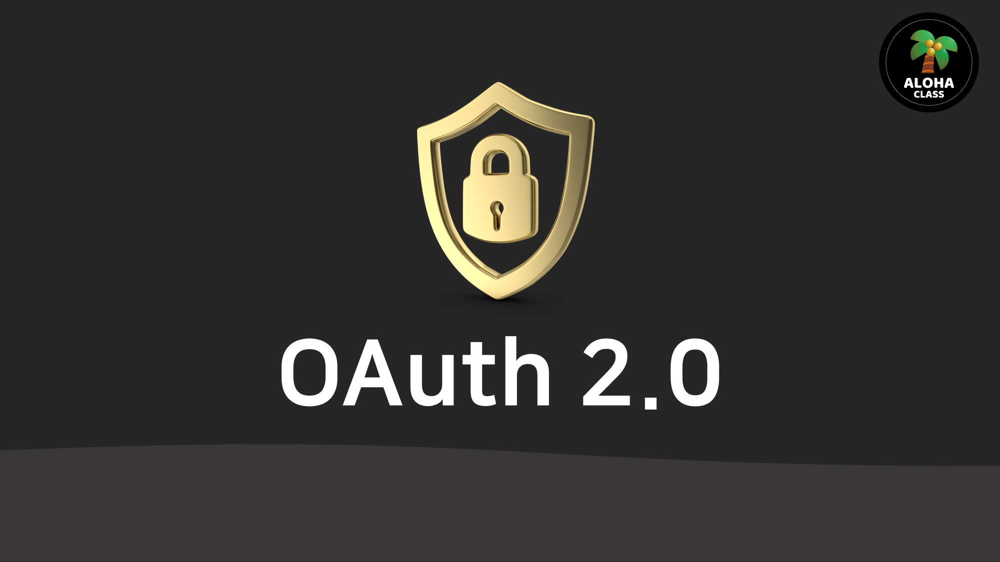
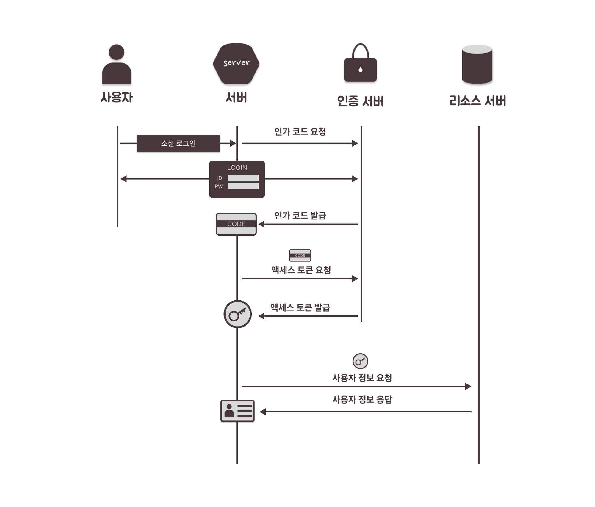

##### 2024-05-10 Spring Security, OAuth 소셜 인증  

### OAuth (Open Authorization)  

✅ Open : 개방형  
✅ Authorization : 인가  
✅ 개방적으로 어플리케이션(서버) 간의 사용자 정보에 대한 접근 허락을 하는 것  

 

### 🔒사용자 정보에 접근하기 위한 개방형 인증 표준  

- OAuth 스펙 문서  
- OAuth 구성 요소  
    - 주체  
        - 사용자  
        - 서버  
        - 인증 서버  
        - 리소스 서버  
    - 주요 정보  
        - 인가 코드  
        - 액세스 토큰  
        - 사용자 정보     
        - OAuth 인증 과정  

 

 

### 주체  

- OAuth 구성 요소에는 사용자, 서버, 인증 서버, 리소스 서버가 있습니다. 
- 여기서 서버는 인증 서버에 대하여 클라이언트가 되는 서버입니다. 
- 일반적으로 구글, 페이스북, 카카오, 네이버가 인증 서버가 되고 제 3의 웹 애플리케이션 서버, 즉 우리가 개발하는 서버가 클라이언트입니다.
 

### 사용자  
 ⭐ 자원의 주인  

    인증 서버에 인증을 받아 서버에 사용자 정보 접근 권한을 위임하는 주체
    인증 서버에 로그인할 사용자를 말합니다.
    
    여기서 말하는 자원은 주로 사용자 정보로, 아이디, 닉네임, 이메일, 프로필 사진 등이 있습니다.

### 서버   
 ⭐ 사용자에게 접근 권한을 위임받아 사용자 정보를 사용할 주체  

    서버는 사용자가 로그인하면, 인증 서버로부터 “인가 코드” 라는 위임장을 받고, 이 위임장을 가지고 금고의 열쇠인 “인증 토큰”를 인증 서버에 요청합니다.
    
    그리고 “인증 토큰”이라는 이 열쇠를 가지고 사용자 정보가 있는 금고인 리소스 서버에 사용자 정보를 요청하고 응답받습니다.

### 인증 서버  
 ⭐ 사용자가 요청한 인증을 처리하여, 서버에게 인가 코드와 인증 토큰을 발급해주는 서버
  

### 리소스 서버  
 ⭐ 사용자 정보를 저장 및 제공하는 서버  

    사용자 정보가 관리되는 서버로, 서버가 “인증 토큰”이라는 열쇠로 사용자 대신 사용자 정보를 요청하면, 서버에게 사용자 정보를 제공해주는 서버입니다.

 
 

### 주요 정보  

### 인가 코드 (Authorization Code)  

 ⭐ 사용자가 인증 서버에 인증(로그인)하면, 인증 서버가 서버한테 발급 해주는 위임장 역할의 코드

• 인가 코드는 보안상의 이유로 사용자의 브라우저를 통해 안전하게 전달됩니다.

• 보통은 클라이언트가 사용자를 인증받고자 할 때 사용됩니다. 예를 들어, 사용자가 서드파티 애플리케이션에 로그인하고 권한을 부여할 때, 인가 코드가 사용될 수 있습니다.

• 인가 코드는 클라이언트가 인증 서버로부터 액세스 토큰을 요청할 때 사용됩니다.

    OAuth 의 목적은 리소스 서버에 있는 사용자 정보를 서버(클라이언트)에 공유하는 것입니다.

    이 때, 사용자는 직접 리소스 서버에 가서 사용자 정보를 가져와서 서버에 제공하지 않고, 서버가 대신 사용자 정보를 가져오라고 시킵니다. 즉, 사용자 정보를 가져오기 위한 권한을 위임해줍니다.

    사용자가 서버에 사용자 정보에 접근하기 위한 권한을 위임해주는 절차는, 사용자가 인증 서버에서 제공해주는 로그인 페이지(구글, 페이스북, 카카오, 네이버 등)에 로그인하는 것입니다.

   

 - 사용자가 인증 서버가 제공해준 로그인 페이지에 로그인을 성공하면, 인증 서버는 서버에 인가 코드를 발급해줍니다. 이 인가 코드는 서버가 사용자 대신 증명서를 발급할 수 있는 위임장과 같은 역할을 합니다.
   

 - 이렇게 사용자는 자신을 대신해서 서버가 자신의 사용자 정보를 가지고 있는 인증 서버에 접근하는 권한을 위임하기 위해 인증 서버에 로그인하여, 인증 서버로 하여금 서버에게 인가 코드를 발급해줄 수 있게 인증합니다.

1. 서버의 소셜 로그인 버튼 클릭
2. 서버가 인증 서버에 인가 코드 요청
3. 사용자가 로그인 페이지에 로그인
4. 인증 서버가 인가 코드를 서버에 발급

 

 

### 액세스 토큰(Access Token)  
 ⭐ 사용자 정보가 있는 리소스 서버의 접근하기 위한 열쇠

- 액세스 토큰은 클라이언트가 리소스 서버에 접근할 수 있도록 권한을 부여받은 후에 사용됩니다.

- 인가 코드를 사용하여 인증 서버로부터 교환되거나, 클라이언트 자격 증명을 직접 사용하여 받을 수 있습니다.

- 이 토큰은 클라이언트가 특정 리소스에 액세스할 때 리소스 서버에 제공됩니다.

- 서버는 사용자에게 권한을 위임 받은 것을 증명하는 인가 코드를 가지고 인증 서버에 액세스 토큰을 요청합니다. 이 때 API KEY, redirect uri, client secret 등의 정보도 포함하여 요청합니다.

- 인증 서버는 서버가 보낸 요청 정보에서 인가 코드와 여러 정보들을 확인하여 인증을 하고 액세스 토큰을 발급합니다. 서버가 액세스 토큰을 발급 받으면 이제 서버는 리소스 서버로 사용자 정보를 요청할 수 있습니다. 
 

1. 서버가 인증 서버에 액세스 토큰 요청
2. 인증 서버가 서버에 액세스 토큰 발급
 

 

 

### 사용자 정보  
 ⭐ 리소스 서버에 저장된 닉네임, 프로필 사진, 이메일 등의 사용자 정보

    - 사용자의 프로필, 이미지, 문서, 또는 기타 관련 데이터를 포함할 수 있습니다. 이 정보는 사용자의 계정에 연결되어 있으며, 해당 사용자의 권한에 따라 다양한 형태로 저장될 수 있습니다.

    - 리소스 서버는 이러한 사용자 정보를 안전하게 보호하고, 인가된 클라이언트에게만 액세스를 허용하여 사용자의 개인정보를 보호합니다. 
    
    일반적으로 OAuth 2.0과 같은 프로토콜을 사용하여 클라이언트가 인가를 받고, 권한을 부여받은 후에만 리소스 서버에 액세스할 수 있습니다.

    - 서버는 인증 서버로부터 발급 받은 액세스 토큰으로 사용자로부터 위임된 자격을 증명을 받고, 리소스 서버에 사용자 정보를 요청합니다. 그러면 리소스 서버는 사용자 정보를 서버에 응답합니다.
 

### OAuth 인증 과정  

- OAuth 인증 과정은 일반적으로 아래와 같습니다.

1. 사용자가 서버의 소셜 로그인 버튼 클릭  
2. 서버가 인증 서버에 인가 코드 요청   
3. 사용자가 로그인 페이지에 로그인  
4. 인증 서버가 인가 코드를 서버에 발급  
5. 서버가 인증 서버에 액세스 토큰 요청  
6. 인증 서버가 서버에 액세스 토큰 발급  
7. 서버가 리소스 서버에 사용자 정보 요청  
8. 리소스 서버가 서버에 사용자 정보 응답  
 