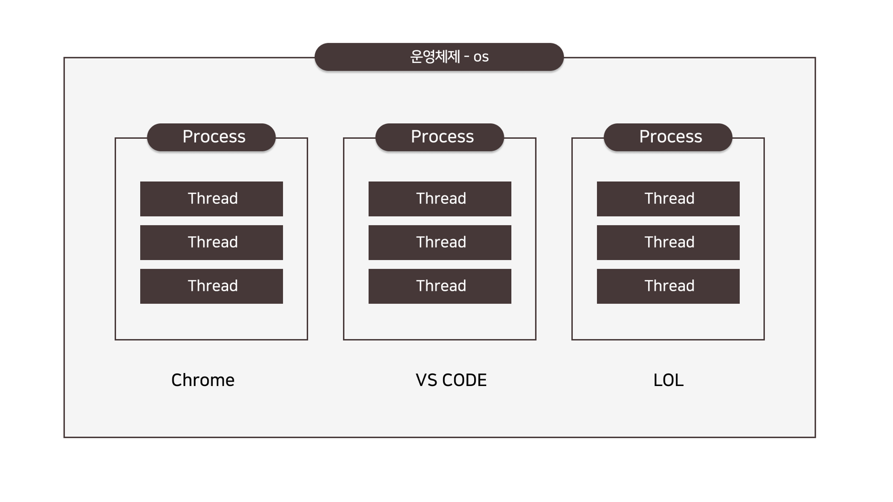
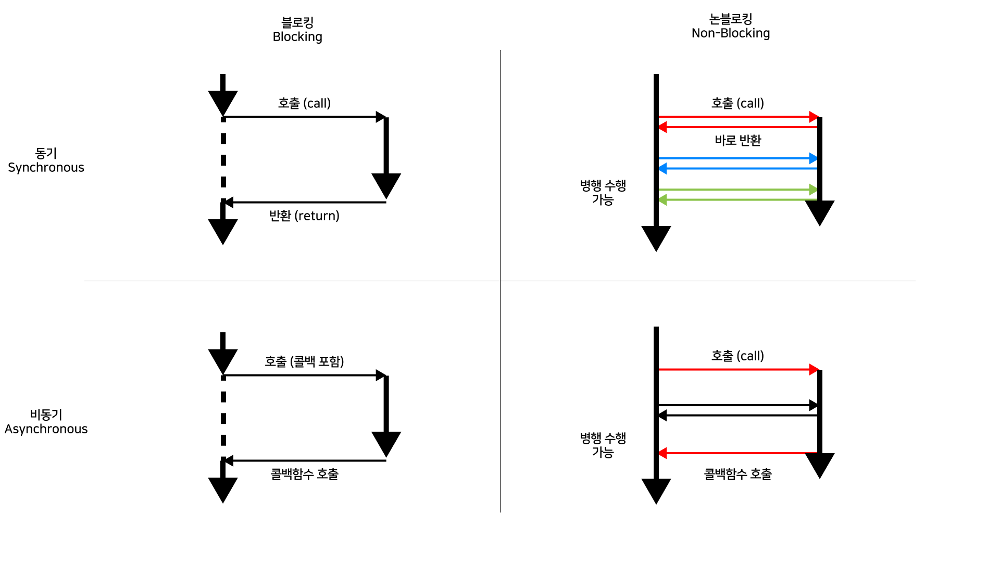

###### 2024-06-11 node.js 수업 내용 1

## node.js 설치 및 개발 환경 설정 <br> 

### node.js 설치 주소

- https://nodejs.org/en

- LTS vs Current
    - LTS(Long-Term Support) 버전은 장기적인 안정성을 보장하기 위해 선택됩니다. <br>
    - LTS 버전은 오랫동안 지원되며 보안 패치 및 버그 수정을 계속 받습니다. 기업 및 대규모 프로젝트에 적합합니다. <br>
    - Current 버전은 가장 최신 기능을 포함하고 있습니다. 이 버전은 새로운 기능을 탐색하고 실험하려는 개발자에게 적합합니다. <br>
    - 하지만 안정성에 대한 보장은 없습니다. <br>
    - Node.js를 설치할 때, 프로젝트의 요구사항과 목적에 따라 LTS 버전 또는 Current 버전을 선택해야 합니다. <br>
<br>


### node.js 설치 확인

``` cmd
node -v
```
<br>

### npm, node package manager <br>
- npm 이란?
    npm은 Node.js 패키지 관리자로, JavaScript 언어를 위한 패키지를 설치하고 관리하는 데 사용됩니다. 
    npm은 개발자들이 다양한 패키지를 사용하여 웹 애플리케이션을 더욱 쉽게 개발할 수 있게 도와줍니다. 
    npm을 사용하면 필요한 패키지를 쉽게 설치하고 최신 버전으로 업데이트할 수 있습니다.
<br>

- -g : global, 이 명령은 npm을 전역으로 설치하여 최신 버전으로 업데이트합니다.
``` cmd 
npm install -g npm
```

### vs code에서 node 시작 하기 <br>
- vscode에서 터미널을 실행한 후 아래 명령어 입력하여 확인!
- 실행은 node ./파일명
- node 종료 명령어는 ctrl + c 두 번 사용
``` cmd
node
let welcome = 'Hello node!'
console.log(welcome)

ctrl + C, ctrl + C
```
<br>

### Node.js 핵심개념 <br>
- 싱글 스레드 (Single-Threaded)
    - Node.js는 기본적으로 싱글 스레드 모델을 채택하고 있습니다. 이는 하나의 주요 스레드에서 이벤트 루프를 통해 모든 작업을 처리한다는 것을 의미합니다.
    - 이는 간단한 구조를 가지고 있어 개발자가 복잡한 동기화 문제를 해결하기 쉽게 만듭니다.
<br>


### 스레드(Thread) 란? <br>
    - 스레드는 컴퓨터 프로세스 내에서 실행되는 최소 실행 단위입니다. 
    - 프로세스는 하나 이상의 스레드로 구성될 수 있으며, 각 스레드는 프로세스의 자원을 공유하면서 병렬로 실행될 수 있습니다.
<br>

### 프로세스 (Process) <br>
    : 운영체제로부터 자원을 할당받는 작업의 단위
    
    - 스레드 (Thread)
    : 프로세스 내의 할당 받은 자원을 이용하는 실행 단위
<br>

### 논블로킹 I/O (Non-Blocking I/O) <br>

    - Node.js는 비동기 및 논블로킹 I/O를 채택하고 있습니다. 
    - 이는 I/O 작업이 완료될 때까지 기다리지 않고 다음 작업을 계속 수행할 수 있음을 의미합니다.
    - 이러한 접근 방식은 많은 동시 연결을 다룰 때 효율적이며, 대용량 데이터를 다룰 때 빠른 응답성을 제공합니다.



- 블로킹 vs 논블로킹
    블로킹과 논블로킹은 함수가 바로 return 되는지 여부에 따라 정해진다.
    블로킹 : 작업이 완료될 때 return
    논블로킹 : 바로 return

- 동기 vs 비동기
    백그라운드 작업 완료 여부를 확인하는지 따라 정해진다.
    동기 :  작업 완료 확인
    비동기: 작업 완료 확인 
<br>

### 이벤트 기반 (Event-Driven) <br>
    - Node.js는 이벤트 기반 아키텍처를 사용합니다. 이벤트가 발생할 때마다 콜백 함수를 호출하여 비동기적으로 작업을 처리합니다.
    - 이러한 모델은 이벤트에 반응하고 빠르게 처리할 수 있도록 도와줍니다.
<br>

### 모듈 시스템 <br>
    - Node.js는 모듈 시스템을 기본적으로 제공하여 코드를 모듈화하고 재사용 가능한 부품으로 나눌 수 있도록 도와줍니다.
    - CommonJS 스타일의 모듈 시스템을 채택하여 코드를 구성하고 모듈 간에 의존성을 관리할 수 있습니다.
<br>

### npm (Node Package Manager) <br>
    - Node.js의 패키지 관리자인 npm은 수많은 오픈 소스 패키지를 제공하며, 개발자들이 패키지를 쉽게 공유하고 재사용할 수 있도록 합니다.
<br>

### V8 엔진 <br>
    - Node.js는 Google Chrome 브라우저에서 사용되는 V8 JavaScript 엔진을 기반으로 합니다. 이 엔진은 빠른 속도와 높은 성능을 제공합니다.
    - Node.js의 이러한 특징들은 특히 웹 서버 및 네트워크 응용 프로그램 개발에 적합하게 만들어져 있습니다. 
    - 비동기적이고 논블로킹 I/O는 동시성을 지원하고, 싱글 스레드 모델은 간단하고 효율적인 코드를 작성할 수 있도록 도와줍니다.
<br>