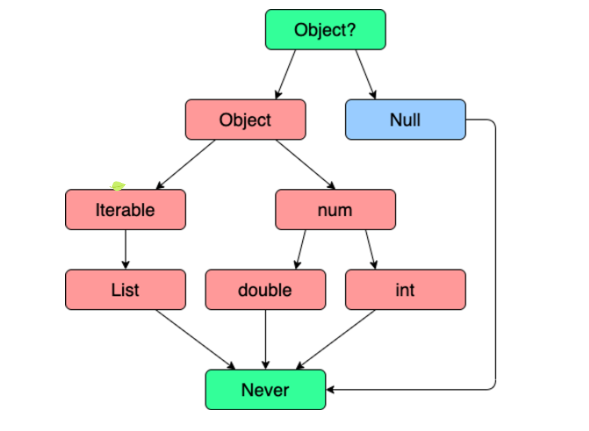

# 2024-07-15 DART 수업 1일차 내용1

# DART 기초 문법

### DART 란?

- 객체지향 프로그래밍 <br>

    : Dart는 객체지향 프로그래밍(OOP) 언어로서, 모든 것이 객체로 취급됩니다. <br>

    클래스와 객체 지향 설계 원칙을 따르며, 코드의 재사용성과 유지보수성을 높이기 위해 설계되었습니다. <br>
<br>

- 가비지 컬렉션 <br>
    : Dart는 가비지 컬렉션을 지원하여 개발자가 직접 메모리를 관리할 필요가 없게 합니다. <br>

    이는 메모리 누수를 방지하고 프로그래머에게 더 안전한 환경을 제공합니다. <br>
<br>

- 단일 상속 및 믹스인(Mixin) 지원 <br>
    : Dart는 단일 상속을 지원하며, 믹스인을 통해 여러 클래스로부터 코드를 재사용할 수 있습니다. <br>

    이는 다중 상속에서 발생할 수 있는 일부 문제를 피할 수 있도록 도와줍니다. <br>
<br>

- 비동기 프로그래밍 <br>
    : Dart는 Future와 Stream과 같은 비동기 프로그래밍을 지원하는데, 이는 효율적인 이벤트 핸들링 및 비동기 작업을 가능하게 합니다. <br>
    async 및 await 키워드를 사용하여 간결한 비동기 코드를 작성할 수 있습니다. <br>
<br>

- 컴파일 언어 <br>
    : Dart는 Just-In-Time(JIT) 컴파일러와 Ahead-of-Time(AOT) 컴파일러를 모두 제공합니다. <br>

    JIT는 개발 중에 코드를 빠르게 테스트할 수 있게 해주고, AOT는 더 높은 실행 속도와 더 작은 배포 크기를 제공합니다. <br>
<br>

- Flutter 프레임워크 <br>
    : Dart는 주로 Flutter 프레임워크를 위한 언어로 사용됩니다. <br>

    Flutter는 모바일, 웹, 데스크톱 등 다양한 플랫폼에서 동작하는 사용자 인터페이스를 만들기 위한 선언적이고 효율적인 방법을 제공하는 UI 프레임워크입니다. <br>
<br>

<br>
<hr>
<br>

### Dart 주요 문법 <br>

#### 변수 <br>
* 데이터(값)를 저장하는 메모리 공간
* 변수 선언 및 초기화
```js
// 변수 선언
var 변수명;

// 변수 초기화
변수명 = 값;

// 변수 선언 및 초기화
var 변수명 = 값;
```

#### 타입 <br>
* 데이터(값)의 형태

<br>

#### 타입 계층 <br>

<br>

#### Null Safety <br>
* 변수나 객체가 null 값을 가질 수 있는지 여부를 명시적으로 관리하여 null 참조 오류를 방지하는 기능 <br>
    
    1. 널 허용 타입 (Nullable Types)
    2. Null Check
    3. Late Keyword
<br>


#### 널 허용 타입 (Nullable Types) <br>
* 타입? - 타입 뒤에 ?를 붙이면 해당 변수나 객체가 null 값을 가질 수 있음을 의미 <br>

```Dart
int? nullIntNumber;
String? nullString;
```
<br>

#### Null 체크 <br>
* nullable 타입의 변수를 사용할 때는 null 체크를 해야 합니다.
* flutter에서 널 허용 타입을 체크하지 않고 접근하면 "컴파일 에러"가 발생합니다. <br>

```dart
// null 체크 예시
String? name;
if (name != null) {
  print(name.length); // 안전하게 name을 사용할 수 있음
}

// ??(null 병합 연산자) : null 값을 대체할 기본값을 제공할 수 있습니다.
String? name;
String displayName = name ?? 'Guest';

// ?. (null-aware 접근 연산자) : 객체가 null이 아닌 경우에만 해당 멤버에 접근이 가능합니다.
String? name;
print(name?.length);

// ??= (null 병합 할당 연산자) : 변수가 null인 경우에만 값을 할당 합니다.
String? name;
name ??= 'Guest';
```
<br>

#### late 키워드 <br>
``` dart
late int lateNumber;
// late 키워드는 변수의 초기화를 나중에 하겠다고 선언합니다.
// - 비동기 통신을 통해서 서버로부터 데이터를 받아 올 것이 확정되어 있는 경우에 주로 사용
```
<br>

<hr>
<hr>

## 상수 <br>

||`const`|`final`|
|--|--|--|
|선언 시점|컴파일 타임 상수|런타임 상수|
|값 할당|선언 시에만 값 할당 가능|선언 후에 값 할당 가능|
|할당 가능 여부|컴파일 타임에 결정된 값만 가능|런타임에 결정된 값 할당 가능|
|활용 예시|상수 문자열, 숫자 등 리터럴 값 사용|설정 후 변경하지 않아야 하는 값 지정|

<br>

## 연산자 <br>

#### 기본 연산자 <br>

|연산자|설명|예시|
|---|---|---|
|+|더하기|a + b|
|-|빼기|a - b|
|*|곱하기|a * b|
|/|나누기|a / b|
|%|나머지|a % b|
|++|증가|a++ 또는 ++a|
|--|감소|a-- 또는 --a|
|+=|더하고 할당|a += b|
|-=|빼고 할당|a -= b|
|*=|곱하고 할당|a *%*= b|
|/=|나누고 할당|a /= b|
|%=|나머지를 계산하고 할당|a %= b|

<br>

#### 타입 연산자 <br>

|연산자|설명|예시|
|---|---|---|
|as|타입 변환|var x = a as int|
|is|타입 체크|if (x is int)|
|is!|타입이 아닌지 체크|if (x is! String)|
<br>

#### Null 연산자 <br>

|연산자|설명|예시|
|---|---|---|
|??|null 일 때 기본값 설정|var y = x ?? defaultValue|
|?.|null 체크 후 접근|var length = str?.length|
|??=|null일 때만 값 할당|a ??= b|
|!|Non-null 단언 연산자|a!|

<br>

* `??` 연산자는 왼쪽 피연산자가 `null`이 아니면 왼쪽 값을, `null`이면 오른쪽 값을 반환합니다.
* `?.` 연산자는 좌변이 `null`이면 무시하고 오른쪽 피연산자에 접근하지 않습ㄴ디ㅏ.
* `??=` 연산자는 왼쪽 피연산자가 `null`이면 오른쪽 값을 왼쪽 변수에 할당하고, 그렇지 않으면 왼쪽 값은 변경되지 않습니다.
* `!` 연산자는 Non-null 단언 연산자로, `변수가 null이 아님을 단언합니다.` 사용 시 주의가 필요하며, null일 경우 예외가 발생할 수 있습니다.

<br>
<hr>

## 제어문 <br>

#### 조건문 <br>
```dart
// if-else
int x = 10;

if (x > 0) {
  print('양수입니다.');
} else if (x < 0) {
  print('음수입니다.');
} else {
  print('0입니다.');
}

// switch
String fruit = 'apple';

switch (fruit) {
  case 'apple':
    print('사과입니다.');
    break;
  case 'banana':
    print('바나나입니다.');
    break;
  default:
    print('알 수 없는 과일입니다.');
}
```
<br>

#### 반복문 <br>

```dart
// for
for (int i = 1; i <= 5; i++) {
  print('현재 숫자는 $i입니다.');
}

// while
int count = 0;

while (count < 3) {
  print('카운트: $count');
  count++;
}

// do-while
int num = 5;

do {
  print('숫자: $num');
  num--;
} while (num > 0);
```

