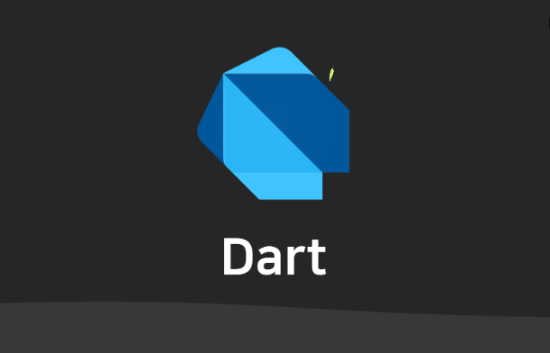

# 2024-07-15 DART 수업 1일차 내용2

### 함수

<br>

* 함수 정의 <br>
```dart
// 형식
타입 메소드명 ( 매개변수1, 매개변수2 ) {
		
}

// 예시 코드
int add(int a, int b) {
  return a + b;
}

void main() {
  print(add(3, 5)); // 출력: 8
}
```
<br>

#### 익명 함수 <br>

```dart
// 형식
( 타입 매개변수1, 타입 매개변수2 ) {  }

// 예시 코드
var multiply = (int a, int b) {
  return a * b;
};

void main() {
  print(multiply(3, 5)); // 출력: 15
}
```
<br>

#### 람다 함수 <br>
```dart
// 람다 함수 정의
(타입 매개변수1, 타입 매개변수2) =>  반환값;
(타입 매개변수1, 타입 매개변수2) => { 실행문 }
(타입 매개변수1, 타입 매개변수2) => { return 반환값; }

// 예시 코드
var multiply = (int a, int b) => a * b;

void main() {
  print(multiply(3, 5)); // 출력: 15
}
```
<br>

#### 재귀 함수 <br>
* 함수 자기 자신을 호출하는 함수 <br>
```dart
int factorial(int n) {
  if (n == 0 || n == 1) {
    return 1;
  } else {
    return n * factorial(n - 1);
  }
}

void main() {
  print(factorial(5)); // 출력: 120
}
```

<br>
<hr>

## 객체 지향 <br>

#### 클래스 <br>
`객체를 정의하는 설계도`

* 클래스 예제 
```dart
// Person 클래스 정의
class Person {
  // 멤버 변수 (속성)
  String name;
  int age;

  // 생성자
  Person(this.name, this.age);

  // 멤버 메서드
  void introduceYourself() {
    print('Hello, my name is $name and I am $age years old.');
  }
}

void main() {
  // Person 클래스의 인스턴스 생성
  var person1 = Person('Alice', 25);

  // 인스턴스의 속성에 접근
  print('Name: ${person1.name}, Age: ${person1.age}');

  // 인스턴스의 메서드 호출
  person1.introduceYourself();  // 출력: Hello, my name is Alice and I am 25 years old.

  // 또 다른 인스턴스 생성
  var person2 = Person('Bob', 30);
  person2.introduceYourself();  // 출력: Hello, my name is Bob and I am 30 years old.
}
```
<br>

#### 객체 <br>
`실세계의 속성과 기능을, 프로그램의 변수와 메소드로 추상화한 것`

* 예시 코드
```dart
// 객체 생성
var 객체명 = 객체명(인자1, 인자2);

// 예시
void main() {
  // Person 클래스의 인스턴스 생성
  var person1 = Person('Alice', 25);

  // 또 다른 인스턴스 생성
  var person2 = Person('Bob', 30);

  // 객체의 속성에 접근
  print('Person 1: Name - ${person1.name}, Age - ${person1.age}');
  print('Person 2: Name - ${person2.name}, Age - ${person2.age}');

  // 객체의 메서드 호출
  person1.introduceYourself();  // 출력: Hello, my name is Alice and I am 25 years old.
  person2.introduceYourself();  // 출력: Hello, my name is Bob and I am 30 years old.
}
```
<br>

#### 생성자 <br>
* 객체를 생성할 대, 변수 또는 메소드를 초기화하기 위해서 실행되는 메소드
* 객체를 초기화하는 특수한 메서드
```dart
// 클래스의 이름과 동일한 이름을 가지며, 매개변수를 가질 수 있습니다.
// 클래스에 명시적인 생성자가 없는 경우 기본 생성자가 자동으로 생성됩니다.

class Person {
  String name;
  int age;

  Person(this.name, this.age); // 생성자

  void sayHello() {
    print('Hello, $name!');
  }
}

void main() {
  var person = Person('John', 25);
  person.sayHello(); // 출력: Hello, John!
}
```
<br>

#### 추상 클래스 <br>
`클래스의 계층적인 설계를 위해, 구현 코드가 없는 추상 메소드로 구성된 클래스`

```dart
// 추상 클래스 키워드 : abstract
abstract class Shape {
  double getArea(); // 추상 메서드
}

class Circle extends Shape {
  double radius;

  Circle(this.radius);

  @override
  double getArea() {
    return 3.14 * radius * radius;
  }
}

// 추상 클래스 키워드는 클래스뿐만 아니라 믹스인에도 적용이 가능하다.
abstract mixin class Musician {
  // No 'on' clause, but an abstract method that other types must define if 
  // they want to use (mix in or extend) Musician: 
  void playInstrument(String instrumentName);

  void playPiano() {
    playInstrument('Piano');
  }
  void playFlute() {
    playInstrument('Flute');
  }
}

class Virtuoso with Musician { // Use Musician as a mixin
  void playInstrument(String instrumentName) {
    print('Plays the $instrumentName beautifully');
  }  
} 

class Novice extends Musician { // Use Musician as a class
  void playInstrument(String instrumentName) {
    print('Plays the $instrumentName poorly');
  }  
}
```
<br>

#### 상속 <br>
`부모 클래스의 변수와 메소드를 자식 클래스에서 재사용하는 것`
```dart
class Animal {
  void makeSound() {
    print('Some generic sound');
  }
}

class Dog extends Animal {
  @override
  void makeSound() {
    print('Woof! Woof!');
  }
}

void main() {
  var dog = Dog();
  dog.makeSound(); // 출력: Woof! Woof!
}
```
<br>

#### 믹스인 (Minin) <br>
`다중 상속을 지원하는 기법`

```dart
// Flying 믹스인
mixin Flying {
  void fly() {
    print('Flying high!');
  }
}

// Swimming 믹스인
mixin Swimming {
  void swim() {
    print('Swimming gracefully!');
  }
}

// Bird 클래스에 Flying 믹스인 적용
class Bird with Flying {
  String name;

  Bird(this.name);
}

// Fish 클래스에 Swimming 믹스인 적용
class Fish with Swimming {
  String name;

  Fish(this.name);
}

// Duck 클래스에 Flying과 Swimming 믹스인 적용 (다중 상속)
class Duck with Flying, Swimming {
  String name;

  Duck(this.name);
}

void main() {
  var eagle = Bird('Eagle');
  eagle.fly(); // 출력: Flying high!

  var salmon = Fish('Salmon');
  salmon.swim(); // 출력: Swimming gracefully!

  var mallard = Duck('Mallard');
  mallard.fly(); // 출력: Flying high!
  mallard.swim(); // 출력: Swimming gracefully!
}

// 믹스인에 대해서도 메소드 오버라이딩이 가능하다.
// Flying 믹스인
mixin Flying {
  void fly() {
    print('Default flying behavior');
  }
}

// Bird 클래스에 Flying 믹스인 적용
class Bird with Flying {
  String name;

  Bird(this.name);

  // Flying 믹스인의 fly 메서드를 오버라이딩
  @override
  void fly() {
    print('$name is flying high!');
  }
}

void main() {
  var eagle = Bird('Eagle');
  eagle.fly(); // 출력: Eagle is flying high!
}
```
<br>

#### enum <br>
`상수들을 열거하여 묶어놓은 타입`

```dart
enum Weekday { monday, tuesday, wednesday, thursday, friday }

void main() {
  var today = Weekday.wednesday;
  print(today); // 출력: Weekday.wednesday
}
```
<br>

#### static <br>
`변수 또는 메소드를 프로그램 실행 시, 가장 먼저 메모리에 고정하는 키워드`

```dart
class Calculator {
  static double add(double a, double b) {
    return a + b;
  }
}

void main() {
  var result = Calculator.add(5.0, 3.0);
  print(result); // 출력: 8.0
}
```

<br>
<hr>

## 컬렉션 <br>
* 컬렉션은 여러 요소를 담을 수 있는 자료 구조

1. List
2. Set
3. Map

<hr>

#### List, 리스트 <br>
1. 순서가 있는 요소들의 모음입니다.
2. 인덱스로 각 요소에 접근할 수 있습니다.
3. 중복된 요소를 허용합니다.

* 예시 코드
```dart
// List 생성과 사용
List<int> numbers = [1, 2, 3, 4, 5];
print(numbers[0]); // 출력: 1
```
<br>

#### Set, 집합 <br>
1. 순서가 없는 고유한 요소들의 모음입니다.
2. 중복된 요소를 허용하지 않습니다.

* 예시 코드
```dart
// Set 생성과 사용
Set<String> fruits = {'apple', 'banana', 'orange'};
fruits.add('apple'); // 이미 존재하는 요소는 추가되지 않음
print(fruits); // 출력: {apple, banana, orange}
```
<br>

#### Map, 맵 <br>
1. 키와 값의 쌍으로 이루어진 요소들의 모음읍니다.
2. 순서가 없습니다.

* 예시 코드
```dart
// Map 생성과 사용
Map<String, int> ages = {'John': 30, 'Alice': 25, 'Bob': 28};
print(ages['Alice']); // 출력: 25

Map<String, dynamic> person = {
  'name': 'John',
  'age': 30,
  'isStudent': false,
};
```
<br>
