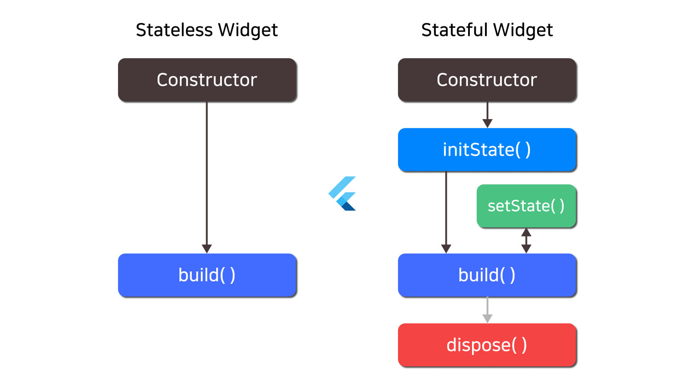

#### 2024-07-16 Flutter 수업 2일차 내용


### Widget(위젯) <br>
* 화면에 표시되는 모든 UI 요소
* 플러터는 위젯을 사용하여 모바일 앱, 웹 앱, 데스크톱 앱 등을 개발할 수 있는 다목적 UI 프레임워크입니다. 
* 위젯은 UI를 빌드하고 레이아웃을 정의하며, 사용자 인터페이스의 각 부분을 표현합니다.
<br>


<br>

### State(상태) <br>
* 화면을 갱신하기 위해서 위젯에서 관리하는 데이터
* 앱의 상태는 사용자와의 상호 작용, 데이터의 변경 등에 따라 변할 수 있습니다. 
* 상태는 주로 StatefulWidget 클래스 내에 정의되며, 해당 클래스를 통해 상태를 변경하고 관리할 수 있습니다.
ex) 카운터 앱
* + 버튼을 누르면 화면의 숫자가 1씩 증가합니다.
* 화면의 숫자가 갱신되기 위해서 해당 위젯에서 숫자를 state 로 관리합니다.


<hr>

# Widget Type (위젯 타입) <br>
* 플러터(Flutter)에서 위젯은 크게 두 가지 타입으로 나누어집니다.
    - StatelessWidget 
    - StatefulWidget
<br>

### StatelessWidget <br>
* 상태가 없는 위젯
    StatelessWidget은 상태를 가지지 않는 위젯입니다. 

    한 번 생성되면 그 상태가 변하지 않으며, 변경되지 않는 정적인 UI를 구성하는 데 사용됩니다. 

    예를 들어, 단순한 텍스트 표시나 이미지 등을 포함하는 정적인 화면을 만들 때 유용합니다. 

    StatelessWidget은 build() 메서드만을 구현하고, 상태 변경이 필요하지 않을 때 사용됩니다.
<br>

* 예시 코드
```dart
class MyStatelessWidget extends StatelessWidget {
  @override
  Widget build(BuildContext context) {
    return Container(
      child: Text('Hello, Stateless Widget!'),
    );
  }
}
```
<hr>
<br>

### StatefulWidget
* 상태를 가지는 위젯
    StatefulWidget은 상태를 가지며, 상태의 변경에 따라 UI를 업데이트할 수 있는 위젯입니다. 
    
    사용자 입력, 데이터 변경 등에 대응하여 동적인 화면을 구성할 때 사용됩니다. 
    
    StatefulWidget은 상태를 관리하는 State 클래스를 가지고 있습니다. 
    
    State 클래스는 위젯의 생명주기와 함께 동작하여 상태의 변경 및 관리를 담당합니다.
<br>

* 예시 코드
```dart
class MyWidget extends StatefulWidget {
  @override
  _MyWidgetState createState() => _MyWidgetState();
}

class _MyWidgetState extends State<MyWidget> {
  int counter = 0;

  void incrementCounter() {
    setState(() {
      counter++;
    });
  }

  @override
  Widget build(BuildContext context) {
    return Column(
      children: [
        Text('Counter: $counter'),
        ElevatedButton(
          onPressed: incrementCounter,
          child: Text('Increment'),
        ),
      ],
    );
  }
}
```

<hr>
<br>

### Widget LifeCycle - 위젯 생명주기 <br>
* 위젯이 생성, 출력, 제거되는 일련의 과정
* 생명주기(LifeCycle)란? <br>
    : 프로그래밍에서의 객체 또는 요소가 생성, 출력, 갱신, 소멸 되는 일련의 과정을 말합니다.



* 위젯은 크게 Stateless Widget 과  Stateful Widget 으로 나누어 볼 수 있는데, Stateless Widget 은 상태가 없기 때문에, 위젯에 들어있는 데이터가 변경되어 다시 갱신되는 일이 없습니다. 

* 그렇기 때문에 Statetless Widget 의 UI 는 단순히 생성되고 출력되기만 하여 별다른 생명주기를 갖지 않습니다.

* Stateful Wiget 위젯은 생성부터 출력 그리고 다시 상태에 따라 갱신되는 등, 일련의 생명주기를 갖습니다. 

* 생명 주기의 과정을 쉽게 정리해보면 다음과 같습니다.
    1. 상태 생성
    2. 상태 초기화
    3. 의존에 의한 갱신
    4. UI 출력
    5. 위젯 갱신
    6. 상태 갱신
    7. 위젯 비활성화
    8. 위젯 소멸
<br>


<br>

### 위젯 생명주기 요약 <br>

|생명주기|메서드|설명|
|----|----|----|
|상태 생성|createState()|StatefulWidget의 상태를 생성하고 반환|
|상태 초기화|initState()|- 1번만 호출 <br> - 초기 설정 및 데이터 요청 작업 수행 <br>|
|의존에 의한 갱신|didChangeDependencies()|initState() 이후에 호출되며, 해당 StatefulWidget이나 상위 위젯 |트리에서 의존성이 변경될 때 호출|
|UI 출력|build()|표시할 위젯(UI)를 반환|
|위젯 갱신|didUpdateWidget()|위젯이 업데이트될 때 호출, 새로운 속성과 이전 속성을 비교하여 |필요한 작업을 수행|
|상태 갱신|setState()|- 변경된 상태 통지 <br> - UI를 갱신<br>|
|위젯 비활성화|deactivate()| - 위젯이 트리에서 벗어나면 호출 <br> - 비활성화 상태로 전환 <br>|
|위젯 소멸|dispose()|- 위젯이 제거될 때 호출 <br> - 리소스를 해제하고 정리 작업을 수행 <br>|

<br>

### 주요 생명주기 메소드 <br>

### initState() <br>
* StatefulWidget 의 상태를 초기화하기 위해, 최초에 한 번만 호출되는 메소드

* 이 메서드는 한 번만 호출되며, 주로 초기화 작업이나 상태 변수 초기화 등을 수행합니다.

* 예를 들어, 특정 데이터를 가져오거나 초기 상태를 설정하는 데 사용됩니다.
```dart
@override
void initState() {
  super.initState();
  // 초기화 작업 수행
  // ✅ 서버로의 데이터 요청
}
```

### build() <br>
* 위젯의 레이아웃과 디자인을을 정의하는 메소드
    - 화면에 UI 가 출력될 때 호출

* 이 메서드에서는 UI를 생성하고 반환하는 역할을 합니다.

* build() 메서드는 상태가 변경될 때마다 호출되며, 변경된 상태에 따라 UI를 업데이트합니다.

```dart
@override
Widget build(BuildContext context) {
  return MaterialApp(
    home: Scaffold(
      appBar: AppBar(
        title: Text('My App'),
      ),
      body: // UI 구성 요소들...
    ),
  );
}
```
<br>

### setState() <br>
* 위젯의 상태를 변경시키고, UI를 갱신을 요청하는 메소드
```dart
void _updateCounter() {
  setState(() {
    _counter++; // 상태 변수 변경
  });
}
```
* setState() 메서드 내부에서 새로운 상태로 업데이트된 변수를 사용하여 UI를 업데이트하면, Flutter는 변경된 상태에 따라 build() 메서드를 호출하여 화면을 다시 그립니다.

<br>
<hr>

# 기본 위젯 <br>


<br>

* 기본 위젯
    * Text
    * Image
    * Icon
    * SafeArea
<br>

### Text <br>
* 화면에 문자열을 출력하는 위젯
* 문법 : Text( 텍스트, 스타일 )
```dart
Text(
  '표시할 텍스트',
  style: TextStyle(
    // 텍스트 스타일 설정 (옵션)
    fontSize: 16.0,
    fontWeight: FontWeight.bold,
    color: Colors.blue,
  ),
)
```
* '표시할 텍스트': 화면에 표시할 텍스트를 지정합니다.
* style: 텍스트의 스타일을 설정하는 옵션 속성입니다. 
* TextStyle 클래스를 사용하여 폰트 크기, 두께, 색상 등을 지정할 수 있습니다.
<br>

### 다양한 텍스트 스타일 <br>

### Text.rich() <br>
* Text.rich( ) 를 사용하면, HTML의 `<span>` 태그 처럼, 여러 텍스트를 나누어 스타일을 줄 수 있습니다.
* 예시
```dart
Text.rich(
  TextSpan(
    text: '일반 텍스트 ',
    style: TextStyle(fontSize: 16.0, color: Colors.black),
    children: <TextSpan>[
      TextSpan(
        text: '서식이 다른 텍스트',
        style: TextStyle(fontWeight: FontWeight.bold, color: Colors.blue),
      ),
      TextSpan(
        text: ' 또 다른 일반 텍스트',
        style: TextStyle(fontSize: 16.0, color: Colors.black),
      ),
    ],
  ),
)
```

<hr>

### Image <br>
* 이미지를 출력하는 위젯
  - 각각 서버에 있는 이미지, 앱 안에 있는 로컬 이미지를 출력하는 위젯이 있습니다.

* Image.network()
  - 네트워크에서 이미지를 가져와 표시하는 Flutter 위젯

* 예시 
```dart
Image.network(
  '이미지의 URL',
  width: 100.0,   // 이미지의 가로 크기 (옵션)
  height: 100.0,  // 이미지의 세로 크기 (옵션)
  fit: BoxFit.cover, // 이미지가 어떻게 화면에 맞출지 설정 (옵션)
)
```
* '이미지의 URL': 표시할 이미지의 URL을 지정합니다.
* width, height: 이미지의 가로 및 세로 크기를 설정합니다. (옵션)
* fit: 이미지가 화면에 맞게 조정되는 방식을 설정합니다. BoxFit 열거형을 사용하여 지정합니다. (옵션)
<br>

* AssetImage <br>
  - 앱 안에 있는 로컬 이미지를 출력하는 위젯
* 예시 
```dart
Image(
  image: AssetImage('assets/image.png'),
  width: 100.0,  // 이미지의 가로 크기 (옵션)
  height: 100.0, // 이미지의 세로 크기 (옵션)
  fit: BoxFit.cover, // 이미지가 어떻게 화면에 맞출지 설정 (옵션)
)
```
* image: 표시할 이미지를 지정합니다. AssetImage는 앱의 자산 폴더에 있는 이미지를 로드할 때 사용됩니다.
* width, height: 이미지의 가로 및 세로 크기를 설정합니다. (옵션)
* fit: 이미지가 화면에 맞게 조정되는 방식을 설정합니다. BoxFit 열거형을 사용하여 지정합니다. (옵션)
<br>

### pubspec.yaml 에서 image 폴더 설정 <br>
  * 앱 내의 로컬 이미지를 사용하려면, pubspect.yaml 에서 이미지 경로를 설정해야합니다.

* 이미지 경로 : my_flutter_app/images
```txt
my_flutter_app/
  |- images/
     |- image1.png
     |- image2.png
  |- lib/
  |- pubspec.yaml
  ...
```
* pubspec.yaml
```yaml
flutter:
  assets:
    - images/
# 여기서 images/는 프로젝트 루트 디렉토리에 있는 images 폴더를 나타냅니다. 이제 해당 이미지 폴더에 있는 이미지 파일들은 Flutter 앱에서 접근 가능하게 됩니다.

# flutter pub get 명령을 사용하여 패키지 의존성을 업데이트해야 합니다.

# 설정 후에는 앱 코드에서 Image.asset를 사용하여 이미지를 로드할 수 있습니다.

# Image.asset('images/image1.png'),
```
<br>

### BoxFit <br>
  - Image 위젯에서 이미지의 화면에 맞추는 방법을 지정하는 속성값(열거형)
<br>

|BoxFit 값|설명|
|---|---|
|contain|이미지가 화면에 딱 맞도록 크기를 조절하며, 화면에 모두 나타남|
|cover|이미지가 화면을 덮도록 크기를 조절하며, 일부가 화면 밖으로 나갈 수 있음|
|fill|이미지가 화면을 가득 채우도록 크기를 조절하며, 일부가 화면 밖으로 나갈 수 있음|
|fitWidth|이미지가 화면 너비에 맞도록 크기를 조절하며, 세로 부분이 잘릴 수 있음|
|fitHeight|이미지가 화면 높이에 맞도록 크기를 조절하며, 가로 부분이 잘릴 수 있음|
|scaleDown|이미지가 원본 크기보다 작을 경우에만 크기를 조절하거나 이미지를 그대로 표시|
|none|이미지를 크기를 조절하지 않고 그대로 표시|

* 예시 코드 <br>

```dart
// contain
// 이미지가 화면에 딱 맞도록 크기를 조절하며, 화면에 모두 나타납니다.
Image.network(
  'https://example.com/image.jpg',
  fit: BoxFit.contain,
)

// cover
// 이미지가 화면을 덮도록 크기를 조절하며, 이미지의 일부가 화면 밖으로 나갈 수 있습니다.
Image.network(
  'https://example.com/image.jpg',
  fit: BoxFit.cover,
)

// fill
// 이미지가 화면을 가득 채우도록 크기를 조절하며, 이미지의 일부가 화면 밖으로 나갈 수 있습니다.
Image.network(
  'https://example.com/image.jpg',
  fit: BoxFit.fill,
)

// fitWidth
// 이미지가 화면 너비에 맞도록 크기를 조절하며, 세로 부분이 잘릴 수 있습니다.
Image.network(
  'https://example.com/image.jpg',
  fit: BoxFit.fitWidth,
)

// fitHeight
// 이미지가 화면 높이에 맞도록 크기를 조절하며, 가로 부분이 잘릴 수 있습니다.
Image.network(
  'https://example.com/image.jpg',
  fit: BoxFit.fitHeight,
)

// scaleDown
// 이미지가 원본 크기보다 작을 경우에만 크기를 조절합니다. 그렇지 않으면 이미지를 그대로 표시합니다.
Image.network(
  'https://example.com/image.jpg',
  fit: BoxFit.scaleDown,
)

// none
// 이미지를 크기를 조절하지 않고 그대로 표시합니다.
Image.network(
  'https://example.com/image.jpg',
  fit: BoxFit.none,
)

// Icon
// 아이콘을 표시하는 위젯
Icon(
  Icons.star, // 사용할 아이콘 (Material Design Icons)
  size: 24.0, // 아이콘의 크기 (옵션)
  color: Colors.yellow, // 아이콘의 색상 (옵션)
)
// Icons.star: 사용할 아이콘을 지정합니다. Icons 클래스는 Material Design Icons를 포함하고 있습니다.
// size: 아이콘의 크기를 설정합니다. (옵션)
// color: 아이콘의 색상을 설정합니다. (옵션)

// SafeArea
// 안전한 공간을 확보해주는 위젯
// SafeArea(
//  child: // 안전한 영역에 배치할 위젯을 설정
// )
import 'package:flutter/material.dart';

void main() {
  runApp(MyApp());
}

class MyApp extends StatelessWidget {
  @override
  Widget build(BuildContext context) {
    return MaterialApp(
      home: Scaffold(
        appBar: AppBar(
          title: Text('SafeArea Example'),
        ),
        body: SafeArea(
          top: true,  // 상단 안전한 영역 사용
          bottom: true,  // 하단 안전한 영역 사용
          left: true,  // 왼쪽 안전한 영역 사용
          right: true,  // 오른쪽 안전한 영역 사용
          minimum: EdgeInsets.all(16.0),  // 네 방향의 최소 안전 여백
          maintainBottomViewPadding: true,  // 하단 여백 유지
          child: Center(
            child: Text(
              'Hello, SafeArea!',
              style: TextStyle(fontSize: 24.0),
            ),
          ),
        ),
      ),
    );
  }
}
```