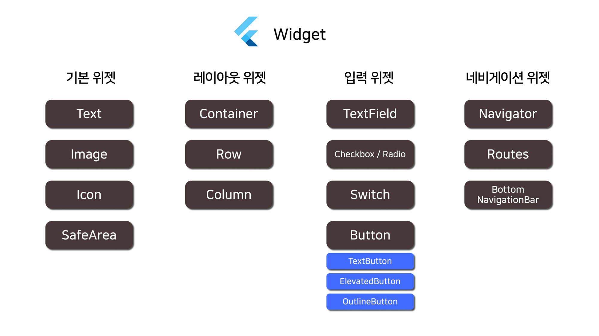

#### 2024-07-17 Flutter 수업 3일차 내용2

## 네비게이션 위젯 <br>


<br>



# 네비게이션 위젯 <br>

* Navigator
* Routes
* BottomNavigationBar
<br>
<hr>

# Navigator <br>
  - 앱 내에서 화면 간 이동을 관리하는 클래스  
  - Navigator 클래스는 앱 내에서 화면 간 이동을 관리하는 역할을 합니다.
  - 새로운 화면으로 이동하거나 이전 화면으로 돌아가는 등의 네비게이션을 제어할 때 사용됩니다.

* 예시 코드
```dart
// 문법
Navigator.push(
  context,
  MaterialPageRoute(builder: (context) => SecondScreen()),
);

Navigator.pop(context);
```

* 예시 
  1. main.dart
  2. first_screen.dart
  3. second_screen.dart

<br>

* 파일 구조
```txt
- lib
  - screens
    - first_screen.dart
    - second_screen.dart
  - main.dart
```

* main.dart <br>

```dart
import 'package:flutter/material.dart';
import 'screens/first_screen.dart';

void main() {
  runApp(MyApp());
}

class MyApp extends StatelessWidget {
  @override
  Widget build(BuildContext context) {
    return MaterialApp(
      home: FirstScreen(),
    );
  }
}
```
<br>

* first_screen.dart <br>
```dart
import 'package:flutter/material.dart';
import 'second_screen.dart';

class FirstScreen extends StatelessWidget {
  @override
  Widget build(BuildContext context) {
    return Scaffold(
      appBar: AppBar(
        title: Text('First Screen'),
      ),
      body: Center(
        child: ElevatedButton(
          onPressed: () {
            Navigator.push(
              context,
              MaterialPageRoute(builder: (context) => SecondScreen()),
            );
          },
          child: Text('Go to Second Screen'),
        ),
      ),
    );
  }
}
```
<br>

* second_screen.dart <br>

```dart
import 'package:flutter/material.dart';

class SecondScreen extends StatelessWidget {
  @override
  Widget build(BuildContext context) {
    return Scaffold(
      appBar: AppBar(
        title: Text('Second Screen'),
      ),
      body: Center(
        child: ElevatedButton(
          onPressed: () {
            Navigator.pop(context);
          },
          child: Text('Go back to First Screen'),
        ),
      ),
    );
  }
}
```
<br>
<br>
<hr>

# Routes <br>
  - 사용되는 각 화면에 대한 경로를 정의하는 속성
  - Routes는 앱에서 사용되는 각 화면에 대한 경로를 정의하는 역할을 합니다. 
  - MaterialApp의 routes 속성에 맵 형태로 경로를 설정할 수 있습니다.

* 예시 코드
```dart
// 문법
MaterialApp(
  routes: {
    '/home': (context) => HomeScreen(),
    '/profile': (context) => ProfileScreen(),
    '/settings': (context) => SettingsScreen(),
  },
);
```

* 예시 <br>
  1. main.dart
  2. home_screen.dart
  3. profile_screen.dart
  4. settings_screen.dart
<br>

* 파일 구조 <br>
```txt
- lib
  - screens
    - home_screen.dart
    - profile_screen.dart
    - settings_screen.dart
  - main.dart
```
<br>

* main.dart <br>
```dart
import 'package:flutter/material.dart';
import 'screens/home_screen.dart';
import 'screens/profile_screen.dart';
import 'screens/settings_screen.dart';

void main() {
  runApp(MyApp());
}

class MyApp extends StatelessWidget {
  @override
  Widget build(BuildContext context) {
    return MaterialApp(
      initialRoute: '/home',
      routes: {
        '/home': (context) => HomeScreen(),
        '/profile': (context) => ProfileScreen(),
        '/settings': (context) => SettingsScreen(),
      },
    );
  }
}
```
<br>

* home_screen.dart <br>
```dart
import 'package:flutter/material.dart';

class HomeScreen extends StatelessWidget {
  @override
  Widget build(BuildContext context) {
    return Scaffold(
      appBar: AppBar(
        title: Text('Home Screen'),
      ),
      body: Center(
        child: Text('This is the Home Screen'),
      ),
    );
  }
}
```
<br>

* profile_screen.dart <br>
```dart
import 'package:flutter/material.dart';

class ProfileScreen extends StatelessWidget {
  @override
  Widget build(BuildContext context) {
    return Scaffold(
      appBar: AppBar(
        title: Text('Profile Screen'),
      ),
      body: Center(
        child: Text('This is the Profile Screen'),
      ),
    );
  }
}
```
<br>

* settings_screen.dart <br>
```dart
import 'package:flutter/material.dart';

class SettingsScreen extends StatelessWidget {
  @override
  Widget build(BuildContext context) {
    return Scaffold(
      appBar: AppBar(
        title: Text('Settings Screen'),
      ),
      body: Center(
        child: Text('This is the Settings Screen'),
      ),
    );
  }
}
```
<br>
<br>
<hr>

# BottomNavigationBar <br>
  - 화면 하단에 나타나는 네비게이션 바
  - BottomNavigationBar는 화면 하단에 나타나는 네비게이션 바로, 여러 개의 화면을 탭으로 구성하고 각 탭을 눌렀을 때 해당 화면으로 이동할 수 있도록 합니다.

* 예시 코드
```dart
// 문법
Scaffold(
  body: _selectedScreen, // 현재 선택된 화면이 표시될 부분
  bottomNavigationBar: BottomNavigationBar(
    items: [
      BottomNavigationBarItem(
        icon: Icon(Icons.home),
        label: 'Home',
      ),
      BottomNavigationBarItem(
        icon: Icon(Icons.person),
        label: 'Profile',
      ),
      BottomNavigationBarItem(
        icon: Icon(Icons.settings),
        label: 'Settings',
      ),
    ],
    currentIndex: _selectedIndex, // 현재 선택된 탭의 인덱스
    onTap: _onTabTapped, // 탭이 눌렸을 때 호출되는 콜백 함수
  ),
);
```

* 예시 <br>
  1. main.dart
  2. home_screen.dart
  3. profile_screen.dart
  4. settings_screen.dart
<br>

* 파일 구조 <br>
```txt
- lib
  - screens
    - home_screen.dart
    - profile_screen.dart
    - settings_screen.dart
  - main.dart
```

* main.dart <br>
```dart
import 'package:flutter/material.dart';
import 'screens/home_screen.dart';
import 'screens/profile_screen.dart';
import 'screens/settings_screen.dart';

void main() {
  runApp(MyApp());
}

class MyApp extends StatefulWidget {
  @override
  _MyAppState createState() => _MyAppState();
}

class _MyAppState extends State<MyApp> {
  // 변수 선언
  Widget _selectedScreen = HomeScreen();
  int _selectedIndex = 0;

  // 탭이 눌렸을 때 호출되는 함수
  void _onTabTapped(int index) {
    setState(() {
      _selectedIndex = index;

      // 선택된 탭에 따라 화면 업데이트
      if (_selectedIndex == 0) {
        _selectedScreen = HomeScreen();
      } else if (_selectedIndex == 1) {
        _selectedScreen = ProfileScreen();
      } else if (_selectedIndex == 2) {
        _selectedScreen = SettingsScreen();
      }
    });
  }

  @override
  Widget build(BuildContext context) {
    return MaterialApp(
      home: Scaffold(
        body: _selectedScreen,
        bottomNavigationBar: BottomNavigationBar(
          items: [
            BottomNavigationBarItem(
              icon: Icon(Icons.home),
              label: 'Home',
            ),
            BottomNavigationBarItem(
              icon: Icon(Icons.person),
              label: 'Profile',
            ),
            BottomNavigationBarItem(
              icon: Icon(Icons.settings),
              label: 'Settings',
            ),
          ],
          currentIndex: _selectedIndex,
          onTap: _onTabTapped,
        ),
      ),
    );
  }
}
```
<br>

* home_screen.dart <br>
```dart
import 'package:flutter/material.dart';

class HomeScreen extends StatelessWidget {
  @override
  Widget build(BuildContext context) {
    return Scaffold(
      appBar: AppBar(
        title: Text('Home Screen'),
      ),
      body: Center(
        child: Text('This is the Home Screen'),
      ),
    );
  }
}
```
<br>

* profile_screen.dart <br>
```dart
import 'package:flutter/material.dart';

class ProfileScreen extends StatelessWidget {
  @override
  Widget build(BuildContext context) {
    return Scaffold(
      appBar: AppBar(
        title: Text('Profile Screen'),
      ),
      body: Center(
        child: Text('This is the Profile Screen'),
      ),
    );
  }
}
```
<br>

* settings_screen.dart <br>
```dart
import 'package:flutter/material.dart';

class SettingsScreen extends StatelessWidget {
  @override
  Widget build(BuildContext context) {
    return Scaffold(
      appBar: AppBar(
        title: Text('Settings Screen'),
      ),
      body: Center(
        child: Text('This is the Settings Screen'),
      ),
    );
  }
}
```
<br>